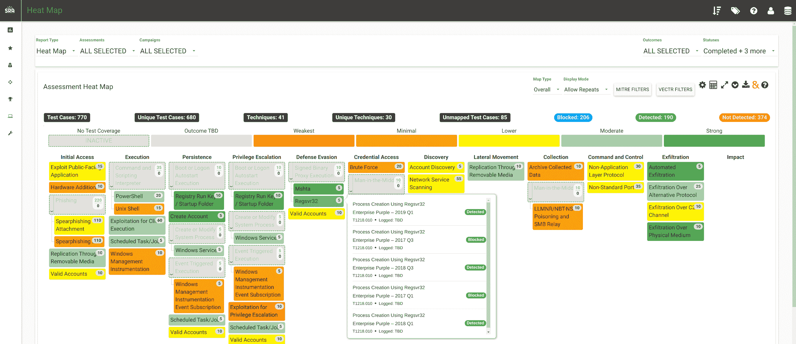
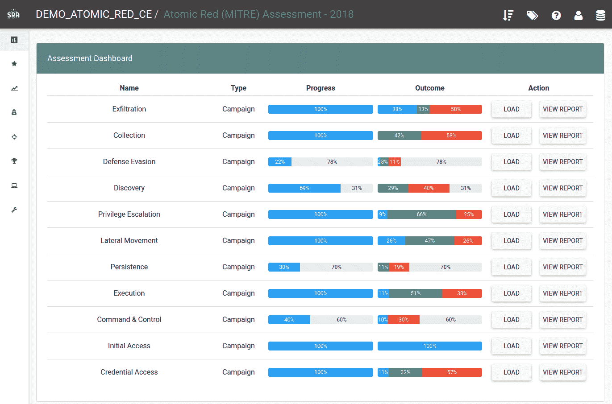
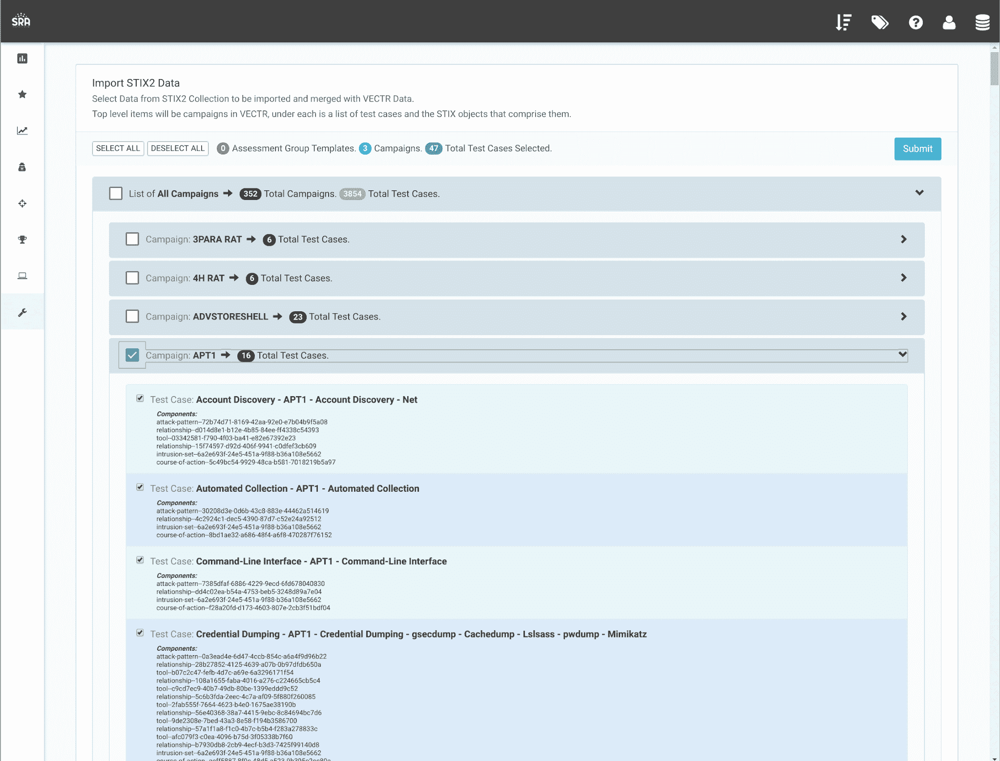

# VECTR:一个工具，便于跟踪红队和蓝队的测试活动，以测量不同攻击场景的检测和预防能力

> 原文：<https://kalilinuxtutorials.com/vectr/>

VECTR 是一个工具，它有助于跟踪红队和蓝队的测试活动，以衡量不同攻击场景的检测和预防能力。VECTR 提供了创建评估组的能力，评估组由一系列模拟对手威胁的活动和支持测试案例组成。活动范围可以很广，跨越整个杀伤链的活动，从最初的危害到权限提升和横向移动等等，也可以很窄，只关注特定的检测层、工具和基础设施。VECTR 旨在促进进攻和防御之间的完全透明，鼓励团队成员之间的培训，并提高整个环境中的检测和预防成功率。

VECTR 侧重于攻击和行为的常见指标，这些攻击和行为可能由任意数量的威胁行动者团体实施，具有不同的目标和复杂程度。VECTR 还可用于复制与特定组和恶意软件活动相关的逐步 TTP，但其主要目的是复制跨越多个威胁参与者组和恶意软件活动的攻击者行为，包括过去、现在和未来。VECTR 旨在随着时间的推移与目标活动、迭代以及红队技能和蓝队检测能力的可测量增强一起使用。VECTR 的最终目标是使网络能够抵御除最复杂的对手和内部攻击之外的所有攻击。

# 开始使用

## 硬件要求

*   GitHub 和 DockerHub 的互联网接入
*   推荐 2 个以上内核
*   最低 4gb 内存
*   100 多 Gb 可用空间

如果使用 AWS，建议使用 t3a.medium 或等效的实例类型

## 特定于 Linux 发行版的依赖项安装说明

[Ubuntu 依赖安装](https://docs.vectr.io/Installation---Ubuntu/)

[CentOS/RHEL 附属设施](https://docs.vectr.io/Installation-CentOS/)

[Linux Mint 依赖安装](https://docs.vectr.io/Installation---Linux-Mint/)

## 一般注释

本指南是针对上述操作系统而编写的。不支持在其他操作系统上安装。

VECTR 是一个大型 web 应用程序和相关的生态系统。为了便于安装，VECTR 机器需要 GitHub/DockerHub 互联网访问，以便 Docker 容器进行更新，并根据需要从 VECTR GitHub 下载文件。配置应该完全包含在。env 文件并由容器自己部署。

## VECTR 安装说明

将 VECTR git 存储库克隆到 VECTR 所在的文件夹中。这是应用程序文件将存放的永久目录。

建议:

**/opt/vectr**

[**Download**](https://github.com/SecurityRiskAdvisors/VECTR)