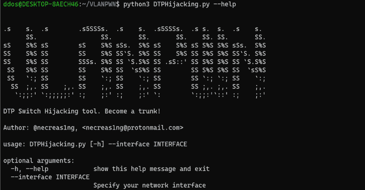

# VLANPWN : VLAN 攻击工具包

> 原文：<https://kalilinuxtutorials.com/vlanpwn/>

**VLAN 攻击工具包**，笔者与那些将这些工具用于个人目的来破坏别人的计算机网络的人无关。这些工具用于培训目的，以帮助工程师提高网络的安全性。

**ᛝ**

**double tagging . py**–该工具旨在执行 VLAN 跳跃攻击。作为注入带有两个 802.1Q 标签的帧的结果，还将发送一个测试 ICMP 请求。

**dtphijacking . py**–进行 DTP 交换机欺骗/劫持攻击的脚本。发送恶意的 DTP-desired 帧，从而使攻击者的机器成为中继信道。这种攻击的影响是，你可以绕过 VLAN 网络的分段，看到 VLAN 网络的所有流量。

**python 3 double tagging . py–help
。s . s。s .s5SSSs。s5SSSs。党卫军。党卫军。党卫军。党卫军。党卫军。党卫军。党卫军。党卫军。
sS S % S sS S % S sSsS % S sS S % S sS S % S S % S sSsS % S
SS S % S SS S % S SS`S. S%S SS S%S SS S%S S%S SS`S . S % S
SS S % S SS SSSsS % S SS`S.S%S SS .sS::' SS S%S S%S SS`S . S % S
SS S % S SS S % S SS`sS%S SS SS S%S S%S SS`SS % S
SS`:; SS SS`:；SS`:; SS SS`:；`:; SS`:；
SS；,.SS；,.SS；,.SS；,.SS SS,.；,.SS；,.
`:;;:'`:；；；；；:' :;；:' :;；:'`:`:；；:'`::' :;；:'
VLAN 双重标记注入工具。跳进另一个 VLAN！
作者:@necreas1ng，necreas1ng@protonmail.com
用法:double tagging . py[-h]–INTERFACE INTERFACE–NATIVEVLAN NATIVEVLAN–target VLAN–受害者–攻击者攻击者
选项:
-h，–帮助显示此帮助消息并退出
–INTERFACE INTERFACE
指定您的网络接口
–NATIVEVLAN NATIVEVLAN
指定本机 VLAN ID
–target VLAN target VLAN
指定目标 VLAN ID**

示例:

**python 3 double tagging . py–interface eth 0–nativevlan 1–target VLAN 20–受害者 10 . 10 . 20 . 24–攻击者 10.10.10.54**

**python 3 dtphijacking . py–help
。s . s。s .s5SSSs。s5SSSs。党卫军。党卫军。党卫军。党卫军。党卫军。党卫军。党卫军。党卫军。
sS S % S sS S % S sSsS % S sS S % S sS S % S S % S sSsS % S
SS S % S SS S % S SS`S. S%S SS S%S SS S%S S%S SS`S . S % S
SS S % S SS SSSsS % S SS`S.S%S SS .sS::' SS S%S S%S SS`S . S % S
SS S % S SS S % S SS`sS%S SS SS S%S S%S SS`SS % S
SS`:; SS SS`:；SS`:; SS SS`:；`:; SS`:；
SS；,.SS；,.SS；,.SS；,.SS SS,.；,.SS；,.
`:;;:'`:；；；；；:' :;；:' :;；:'`:`:；；:'`::' :;；:'
DTP 交换机劫持工具。变成树干！
作者:@necreas1ng，necreas1ng@protonmail.com
用法:dtphijacking . py[-h]–界面界面
选项:
-h，–帮助显示此帮助信息并退出
–界面界面
指定您的网络界面**

示例:

**python 3 dtphijacking . py–接口 eth0**

[**Download**](https://github.com/in9uz/VLANPWN)