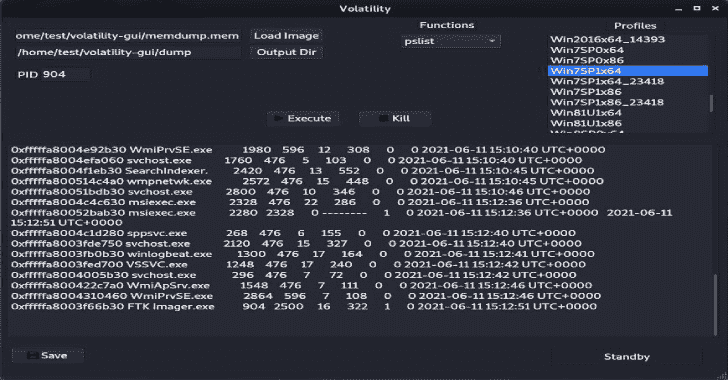

# 挥发性 GUI:挥发性取证工具的 GUI

> 原文：<https://kalilinuxtutorials.com/volatility-gui/>

这是一个用 PyQT5 写的易失性取证工具的 GUI。

**先决条件**

1-安装的 Volatility 版本。

2-安装 PyQT5。

**sudo apt-get 安装 python3-pyqt5**

3-下载易变图形用户界面

**配置**

从下载的 Volatility GUI 中，编辑`**config.py**`文件，在**T1 中指定 1- Python 2 二进制名或 Python 2 绝对路径。**

**中的 2-波动率二元绝对路径`volatility_bin_loc`。**

然后运行`**config.py**`脚本，根据您的配置构建配置文件列表`**python3 config.py**`

之后，通过运行 **`python3 vol_gui.py`启动 gui。**