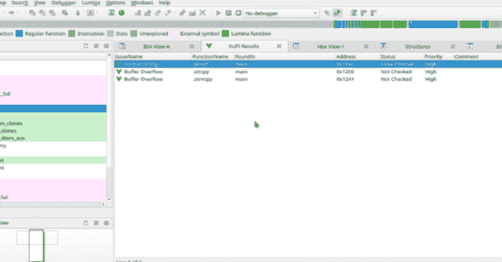

# VulFi:IDA Pro 的一个插件，可以用来帮助在二进制文件中查找 Bug

> 原文：<https://kalilinuxtutorials.com/vulfi/>

**VulFi** (漏洞查找器)工具是 IDA Pro 的一个插件，可以用来协助二进制文件中的 bug 搜索。它的主要目的是提供一个单一的视图，其中包含所有最有趣的函数的交叉引用(如 **`strcpy`、`sprintf`、`system`** 等)。).对于可以使用 Hexrays 反编译器的情况，它会试图排除对这些函数的调用，这些函数从漏洞研究的角度来看是不有趣的(想想类似`**strcpy(dst,"Hello World!")**`)。没有反编译器，规则就简单多了(不依赖于架构)，因此只排除最明显的情况。

## 安装

将 **`vulfi.py`、`vulfi_prototypes.json`** 、`**vulfi_rules.json**`文件放入 IDA 插件文件夹(`**cp vulfi* <IDA_PLUGIN_FOLDER>**`)。

## 准备数据库文件

在运行 VulFi 之前，请确保您对所使用的二进制文件有很好的理解。尝试识别所有标准函数( **`strcpy`、`memcpy`** 等)。)并据此命名。该插件不区分大小写，因此 **`MEMCPY`、`Memcpy`** 和`**memcpy**`都是有效名称。但是，请注意，函数的搜索需要完全匹配。这意味着`**memcpy?**`或`**std_memcpy**`(或任何其他变体)不会被检测为标准函数，因此在寻找潜在漏洞时不会被考虑。如果你正在处理一个未知的二进制文件，你需要先设置编译器选项 **`Options` > `Compiler`** 。之后，VulFi 会尽最大努力过滤所有明显的误报(比如用常量字符串作为第一个参数调用`**printf**`)。请注意，虽然该插件与特定架构没有任何联系，但有些处理器并不完全支持指定类型，在这种情况下，VulFi 将简单地标记所有对潜在危险的标准函数的交叉引用，以允许您继续进行手动分析。在这些情况下，您可以受益于插件的跟踪功能。

## 用法

### 扫描

要启动扫描，从顶部工具栏菜单中选择`**Search**` > `**VulFi**`选项。这将启动新的扫描，或者它将读取存储在 **`idb` / `i64`** 文件中的先前结果。每当保存数据库时，数据都会自动保存。

一旦扫描完成或加载了先前的结果，将出现一个表格，其中包含以下各列:

*   **问题名称**–用作可疑问题的标题。
*   **功能名称**–功能的名称。
*   **found in**–包含潜在有趣引用的函数。
*   **地址**–检测到的呼叫的地址。
*   **状态**–审核状态，初始`**Not Checked**`被分配给每个新项目。其他状态有`**False**` **`Positive`、`Suspicious`和`Vulnerable`** 。这些可以使用给定项目上的右键菜单来设置，并且应该反映给定函数调用的手动检查的结果。
*   **优先级**–尝试将更有趣的电话优先于不太有趣的电话。可能的值有 **`High`、`Medium`** 和`**Low**`。优先级与其他规则一起在`v**ulfi_rules.json**`文件中定义。
*   **注释**–给定项目的用户定义注释。

如果 **`idb` / `i64`** 文件中没有数据或者用户决定执行新的扫描。插件将询问它是否应该使用默认包含的规则运行扫描，或者是否应该使用自定义规则文件。请注意，使用现有数据运行新的扫描不会覆盖以前找到的项目，这些项目由与以前存储的结果同名的规则标识。因此，再次运行扫描不会删除现有的注释和状态更新。

在 VulFi 视图的右键上下文菜单中，您还可以从结果中删除项目或删除所有项目。请注意，执行此操作后，任何评论或状态更新都将丢失。

### 调查

每当您想要检查检测到的可能易受攻击的函数的实例时，只需双击所需行中的任意位置，IDA 就会将您带到被识别为可能感兴趣的内存位置。使用右键单击和选项`Set Vulfi Comment`允许您输入给定实例的注释(例如证明状态)。

### 添加更多功能

该插件还允许创建自定义规则。这些规则可以在 IDA 接口中定义(适用于单个功能)，或者作为自定义规则文件提供(适用于旨在涵盖多个功能的规则)。

#### 在界面内

当您想要跟踪在分析过程中识别的自定义函数时，只需将 IDA 视图切换到该函数，右键单击函数体中的任意位置并选择 **`Add current function to VulFi`。**

#### 自定义规则集

也可以加载一个包含多个规则的自定义文件。要创建具有以下结构的自定义规则文件，您可以使用此处包含的模板文件。

**[ //规则数组
{
"name": "RULE NAME "，//规则的名称
" alt _ names ":[
" function _ NAME _ to _ Look _ for "//根据本规则定义的条件应该匹配的所有函数名称的列表
，
"wrappers":true，//也查找上述函数的包装器(注意被包装的函数也要匹配规则)
"mark_if":{
"High "::") 用高优先级标记(参见下面的规则)
“中”:“假”，//如果评估为真，用优先级中标记(参见下面的规则)
“低”:“假”//如果评估为真，用优先级低标记(参见下面的规则)
}
}
]**

下面显示了一个示例规则，该规则查找对函数`**malloc**`的所有交叉引用，并检查其参数是否不是常数，以及是否检查了函数的返回值:

**{
"name ":"可能的空指针取消引用"，
"alt_names":[
"malloc "，
"_malloc "，
"。malloc"
，
"wrappers":false，
" mark _ if ":{
" High ":" not param[0]。is_constant()和 not function _ call . return _ value _ checked()"、
"中":"假"、
"低":"假"
}
}**

[**Download**](https://github.com/Accenture/VulFi)