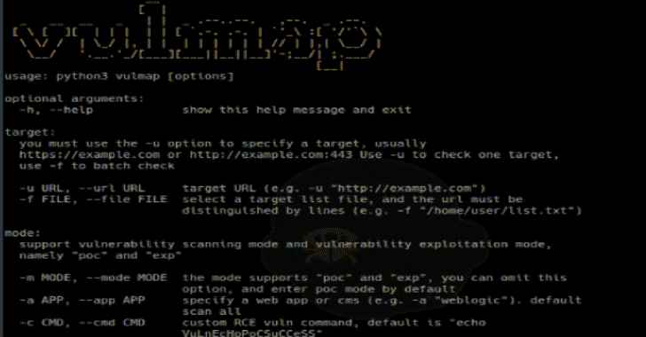

# Vulmap:网络漏洞扫描和验证工具

> 原文：<https://kalilinuxtutorials.com/vulmap/>

[](https://1.bp.blogspot.com/-XcUWpfvYumE/X-pQ6Kk629I/AAAAAAAAIOs/BT5tp7wb7oQv8_S7OA3j3sP4RpA0vILYgCLcBGAsYHQ/s728/Vulmap%25281%2529.png)

**Vulmap** 是一款漏洞扫描工具，可以扫描 Web 容器、Web 服务器、Web 中间件以及 CMS 等 Web 程序中的漏洞，具有漏洞利用功能。相关测试人员可以使用 vulmap 来检测目标是否存在特定的漏洞，并可以使用漏洞利用功能来验证漏洞是否实际存在。

它目前有漏洞扫描(poc)和利用(exp)模式。使用“-m”选择要使用的模式，默认 poc 模式是默认模式。在 poc 模式下，还支持“-f”批量目标扫描，“-o”文件输出结果等主函数，其他函数 [Options](https://github.com/zhzyker/vulmap/#options) 或 python3 vulmap.py -h，在漏洞利用模式下不再提供 Poc 函数，而是直接进行利用，并反馈利用结果，进一步验证漏洞是否存在，是否可以利用。

**尽量使用“-a”建立目标类型，减少误报，如“-a Solr”**

**安装**

操作系统必须安装 python3，建议安装 python3.7 或更高版本

*   安装依赖性

**pip 3 install-r requirements . txt**

*   Linux 和 MacOS 和 Windows

**python 3 vul map . py-u http://example.com**

**选项**

可选参数:
-h，–help 显示此帮助信息并退出
-u url，–URL URL 目标 URL(如-u " http://example . com ")
-f FILE，–FILE FILE 选择一个目标列表文件，URL 必须用行来区分(如-f "/home/user/list . txt))
-m MODE，–MODE MODE 支持" poc "和" exp "，可以省略此选项，默认进入 poc 模式
-a APP，–默认扫描所有
-c CMD，–CMD CMD 自定义 RCE vuln 命令，除了“netstat -an”和“id”会影响程序判断。defautl 为" netstat -an"
-v VULN，–VULN VULN Exploit，指定 VULN 号(如-v " CVE-2020-2729 ")
–list 显示支持扫描的漏洞列表
–Debug 调试模式回显请求和响应
–DELAY 延迟检查时间，默认 0s
–time out 扫描超时时间，默认 10s
–输出文件文本模式导出(如-o "result.txt ")

**例题**

*   测试所有漏洞 poc 模式

**python 3 vul map . py-u http://example.com**

*   对于 RCE vuln，使用“id”命令来测试 vuln，因为有些 linux 没有“netstat -an”命令

**python 3 vul map . py-u http://example.com-c " id "**

*   检查[http://example.com](http://example.com)的支柱 2 是否受损

**python 3 vul map . py-u http://example.com-a struts 2**

**python 3 vul map . py-u http://example.com-m POC-a struts 2**

*   在[http://example.com:7001](http://example.com:7001)上利用 WebLogic 的 CVE-2019-2729 漏洞

**python 3 vul map . py-u http://example.com:7001-v CVE-2019-2729**

**python 3 vul map . py-u http://example.com:7001-m exp-v CVE-2019-2729**

*   批量扫描 list.txt 中的 URL

**python 3 vul map . py-f list . txt**

*   将扫描结果导出到 result.txt

**python 3 vul map . py-u http://example.com:7001-o result . txt**

**漏洞列表**

Vulmap 支持的漏洞如下

```
+-------------------+------------------+-----+-----+-------------------------------------------------------------+
 | Target type       | Vuln Name        | Poc | Exp | Impact Version && Vulnerability description                 |
 +-------------------+------------------+-----+-----+-------------------------------------------------------------+
 | Apache Shiro      | CVE-2016-4437    |  Y  |  Y  | <= 1.2.4, shiro-550, rememberme deserialization rce         |
 | Apache Solr       | CVE-2017-12629   |  Y  |  Y  | < 7.1.0, runexecutablelistener rce & xxe, only rce is here  |
 | Apache Solr       | CVE-2019-0193    |  Y  |  N  | < 8.2.0, dataimporthandler module remote code execution     |
 | Apache Solr       | CVE-2019-17558   |  Y  |  Y  | 5.0.0 - 8.3.1, velocity response writer rce                 |
 | Apache Struts2    | S2-005           |  Y  |  Y  | 2.0.0 - 2.1.8.1, cve-2010-1870 parameters interceptor rce   |
 | Apache Struts2    | S2-008           |  Y  |  Y  | 2.0.0 - 2.3.17, debugging interceptor rce                   |
 | Apache Struts2    | S2-009           |  Y  |  Y  | 2.1.0 - 2.3.1.1, cve-2011-3923 ognl interpreter rce         |
 | Apache Struts2    | S2-013           |  Y  |  Y  | 2.0.0 - 2.3.14.1, cve-2013-1966 ognl interpreter rce        |
 | Apache Struts2    | S2-015           |  Y  |  Y  | 2.0.0 - 2.3.14.2, cve-2013-2134 ognl interpreter rce        |
 | Apache Struts2    | S2-016           |  Y  |  Y  | 2.0.0 - 2.3.15, cve-2013-2251 ognl interpreter rce          |
 | Apache Struts2    | S2-029           |  Y  |  Y  | 2.0.0 - 2.3.24.1, ognl interpreter rce                      |
 | Apache Struts2    | S2-032           |  Y  |  Y  | 2.3.20-28, cve-2016-3081 rce can be performed via method    |
 | Apache Struts2    | S2-045           |  Y  |  Y  | 2.3.5-31, 2.5.0-10, cve-2017-5638 jakarta multipart rce     |
 | Apache Struts2    | S2-046           |  Y  |  Y  | 2.3.5-31, 2.5.0-10, cve-2017-5638 jakarta multipart rce     |
 | Apache Struts2    | S2-048           |  Y  |  Y  | 2.3.x, cve-2017-9791 struts2-struts1-plugin rce             |
 | Apache Struts2    | S2-052           |  Y  |  Y  | 2.1.2 - 2.3.33, 2.5 - 2.5.12 cve-2017-9805 rest plugin rce  |
 | Apache Struts2    | S2-057           |  Y  |  Y  | 2.0.4 - 2.3.34, 2.5.0-2.5.16, cve-2018-11776 namespace rce  |
 | Apache Struts2    | S2-059           |  Y  |  Y  | 2.0.0 - 2.5.20 cve-2019-0230 ognl interpreter rce           |
 | Apache Struts2    | S2-devMode       |  Y  |  Y  | 2.1.0 - 2.5.1, devmode remote code execution                |
 | Apache Tomcat     | Examples File    |  Y  |  N  | all version, /examples/servlets/servlet/SessionExample      |
 | Apache Tomcat     | CVE-2017-12615   |  Y  |  Y  | 7.0.0 - 7.0.81, put method any files upload                 |
 | Apache Tomcat     | CVE-2020-1938    |  Y  |  Y  | 6, 7 < 7.0.100, 8 < 8.5.51, 9 < 9.0.31 arbitrary file read  |
 | Drupal            | CVE-2018-7600    |  Y  |  Y  | 6.x, 7.x, 8.x, drupalgeddon2 remote code execution          |
 | Drupal            | CVE-2018-7602    |  Y  |  Y  | < 7.59, < 8.5.3 (except 8.4.8) drupalgeddon2 rce            |
 | Drupal            | CVE-2019-6340    |  Y  |  Y  | < 8.6.10, drupal core restful remote code execution         |
 | Jenkins           | CVE-2017-1000353 |  Y  |  N  | <= 2.56, LTS <= 2.46.1, jenkins-ci remote code execution    |
 | Jenkins           | CVE-2018-1000861 |  Y  |  Y  | <= 2.153, LTS <= 2.138.3, remote code execution             |
 | Nexus OSS/Pro     | CVE-2019-7238    |  Y  |  Y  | 3.6.2 - 3.14.0, remote code execution vulnerability         |
 | Nexus OSS/Pro     | CVE-2020-10199   |  Y  |  Y  | 3.x  <= 3.21.1, remote code execution vulnerability         |
 | Oracle Weblogic   | CVE-2014-4210    |  Y  |  N  | 10.0.2 - 10.3.6, weblogic ssrf vulnerability                |
 | Oracle Weblogic   | CVE-2017-3506    |  Y  |  Y  | 10.3.6.0, 12.1.3.0, 12.2.1.0-2, weblogic wls-wsat rce       |
 | Oracle Weblogic   | CVE-2017-10271   |  Y  |  Y  | 10.3.6.0, 12.1.3.0, 12.2.1.1-2, weblogic wls-wsat rce       |
 | Oracle Weblogic   | CVE-2018-2894    |  Y  |  Y  | 12.1.3.0, 12.2.1.2-3, deserialization any file upload       |
 | Oracle Weblogic   | CVE-2019-2725    |  Y  |  Y  | 10.3.6.0, 12.1.3.0, weblogic wls9-async deserialization rce |
 | Oracle Weblogic   | CVE-2019-2729    |  Y  |  Y  | 10.3.6.0, 12.1.3.0, 12.2.1.3 wls9-async deserialization rce |
 | Oracle Weblogic   | CVE-2020-2551    |  Y  |  N  | 10.3.6.0, 12.1.3.0, 12.2.1.3-4, wlscore deserialization rce |
 | Oracle Weblogic   | CVE-2020-2555    |  Y  |  Y  | 3.7.1.17, 12.1.3.0.0, 12.2.1.3-4.0, t3 deserialization rce  |
 | Oracle Weblogic   | CVE-2020-2883    |  Y  |  Y  | 10.3.6.0, 12.1.3.0, 12.2.1.3-4, iiop t3 deserialization rce |
 | Oracle Weblogic   | CVE-2020-14882   |  Y  |  Y  | 10.3.6.0, 12.1.3.0, 12.2.1.3-4, 14.1.1.0.0, console rce     |
 | RedHat JBoss      | CVE-2010-0738    |  Y  |  Y  | 4.2.0 - 4.3.0, jmx-console deserialization any files upload |
 | RedHat JBoss      | CVE-2010-1428    |  Y  |  Y  | 4.2.0 - 4.3.0, web-console deserialization any files upload |
 | RedHat JBoss      | CVE-2015-7501    |  Y  |  Y  | 5.x, 6.x, jmxinvokerservlet deserialization any file upload |
 | ThinkPHP          | CVE-2019-9082    |  Y  |  Y  | < 3.2.4, thinkphp rememberme deserialization rce            |
 | ThinkPHP          | CVE-2018-20062   |  Y  |  Y  | <= 5.0.23, 5.1.31, thinkphp rememberme deserialization rce  |
 +-------------------+------------------+-----+-----+-------------------------------------------------------------+
```

**码头工人**

**坞站建设-t vulcmap/vulcmap。
坞站运行–RM-ti vulcmap/vulcmap python vulcmap . py-u https://www . example . com**

[**Download**](https://github.com/zhzyker/vulmap)