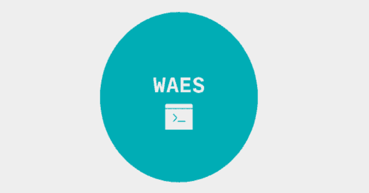

# WAES:网络自动枚举和扫描器

> 原文：<https://kalilinuxtutorials.com/waes-web-auto-enum-scanner/>

**WAES** 不过是网络自动枚举&扫描仪。使用 HTTP(S)对目标进行 HTB 或其他 CTFs 枚举可能变得微不足道。总是在每台机器上运行相同的脚本/测试会令人厌烦，例如 nmap、nikto、dirb 等等。

一键点击目标，自动报告来解决这个问题。此外，使用脚本可以优化 enum 过程，同时为黑客节省时间。这就是 **CPH:SEC WAES** 或*网络自动枚举&扫描器*被创建的目的。WAES 对目标进行 4 步扫描(见下文)以优化扫描时间。

虽然可以实现多核或多线程扫描，但这几乎肯定会导致系统挂起，因此是不可取的。

*   从目前的版本和未来的 WAES 将包括一个安装脚本(见吹)作为项目从阿尔法到测试阶段。
*   WAES 可以用 python 开发，但是学习 bash 需要好的 bash 项目。
*   WAES 目前是为 CTF 盒子制造的，但是正在向在线应用发展

**安装**

**>git 克隆 https://github . com/Shiva 108/waes . git
>CD waes
>sudo。/install.sh**

确保 supergobuster.sh 中的目录设置正确。在 Kali & Parrot Linux 中应该是自动的。

*   列表的标准目录:sec lists/Discovery/we B- Content&sec lists/Discovery/we B- Content/CMS
*   **Kali / Parrot 目录列表:/usr/share/word lists/dir buster/**

**跑 WAES**

Web 自动枚举和扫描-自动枚举网站并转储文件作为结果。

**## # # # # # # # # # # # # # # # # # # # # # # # # # # # # # # # # # Web 自动枚举&扫描仪

自动枚举网站并转储文件作为结果# # # # # # # # # # # # # # # # # # # # # # # # # # # # # # # # # # # # # # # # # # # # # # # # # # # # # # # # # # # # # # # # **

用法:waes.sh -u {IP} waes.sh -h

**-h 显示此帮助
-u IP 来测试例如 10.10.10.123
-p port nummer(默认=80)

示例:。/waes . sh-u 10 . 10 . 10 . 130-p 8080**

**也可阅读—[丝卡蒂:收集、处理&亨特从 MacOS、Windows&Linux](https://kalilinuxtutorials.com/skadi-macos-windows-linux/)获得的基于主机的数据**

**枚举过程/方法**

**步骤 0–被动扫描–(在当前版本中禁用)**

*   what web–积极模式
*   OSIRA(同一作者)-寻找子域

**步骤 1–快速扫描**

*   wafw 00–防火墙检测
*   带有 http-enum 的 nmap

**第二步–深度扫描**

*   nmap–使用 NSE 脚本:http-date、http-title、http-server-header、http-headers、http-enum、http-devframework、http-dombased-xss、http-stored-xss、http-xssed、http-cookie-flags、http-errors、http-grep、http-traceroute
*   使用 vulscan 的 nmap(CVSS 5.0 以上版本)
*   尼克托-带有闪避 A 和所有 CGI dirs
*   unis can–除压力测试(qweds)之外的所有测试

**步骤 3–模糊化**

*   超级敢死队
    *   多列表 gobuster
    *   具有多个列表的目录
*   xss 扫描(即将推出)

..转储报告/文件夹中的结果文件时针对目标。

**做**

*   实现域作为输入
*   添加 XSS 扫描
*   添加 SSL/TLS 扫描
*   添加域扫描
*   把歌利亚给我
*   Add dirble
*   添加进度条
*   添加 CMS 检测
*   添加 CMS 特定扫描

[**Download**](https://github.com/Shiva108/WAES)