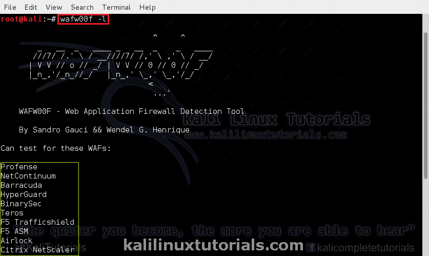
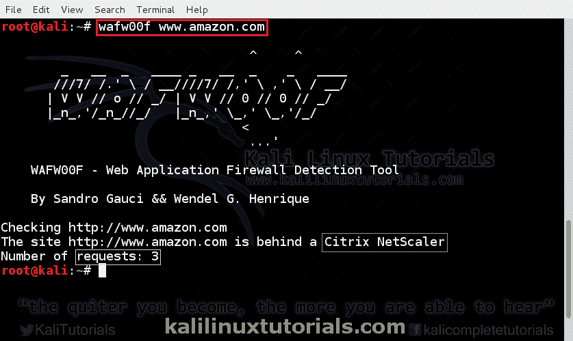
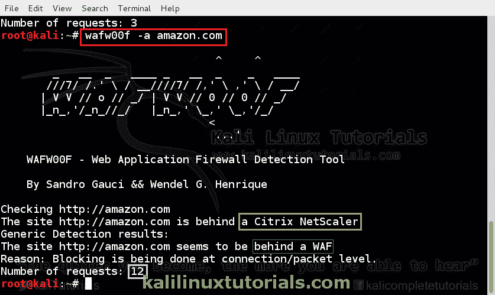
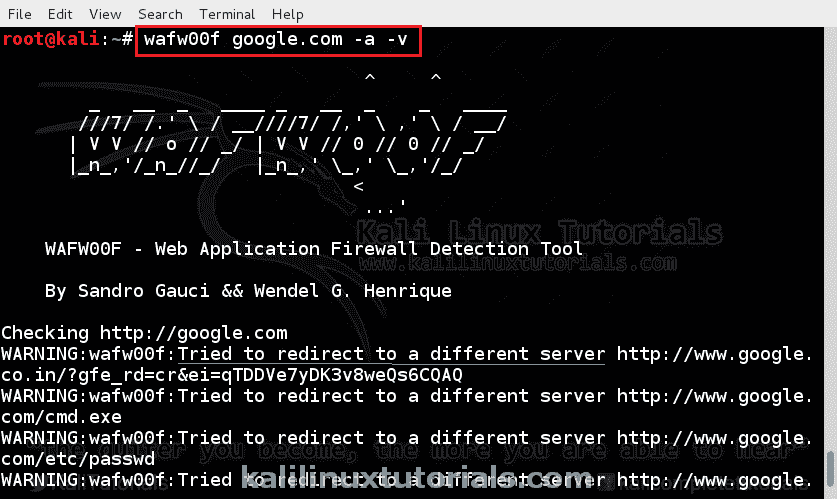
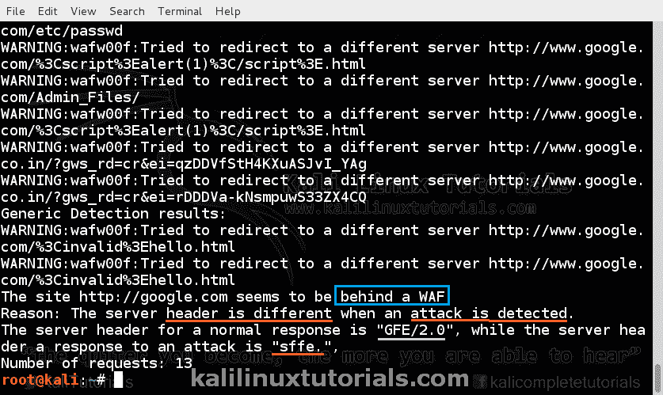

# 使用 WAFW00F 的 Web 应用防火墙的侦察、识别和指纹识别

> 原文：<https://kalilinuxtutorials.com/wafw00f/>

Web 应用防火墙通常是工作在应用层的防火墙，它监控和修改 HTTP 请求。关键的区别在于 WAFs 工作在 OSI 模型的第 7 层——应用层。

基本上，所有的 waf 都可以抵御不同的 HTTP 攻击和查询，比如 SQLi 和 XSS。由于防火墙能够检测 HTTP 方法、SQL 查询和其他作为网站中不同表单的输入的脚本，它可以像普通防火墙一样过滤掉请求。一个人可以执行一个政策，规定什么应该被允许，什么不应该通过网站输入。

WAF 通常出现在 web 应用程序中，在该应用程序中，像银行网站或电子商务网站一样，启用了严格传输安全性。在进行 pentest 时，检测 waf 归入 recon，并映射 web 应用程序架构。在黑盒测试的情况下，应该检测 WAF 的存在并对其进行评估。这在确定 Web 应用程序渗透测试的方法时起着至关重要的作用。

Wafw00f 只是一个 python 工具，它自动执行一组用于查找 WAF 的过程。Wafw00f 只是用一组 HTTP 请求和方法来查询 web 服务器。它分析来自它们的响应并检测防火墙的位置。

首页:[https://github.com/sandrogauci/wafw00f](https://github.com/sandrogauci/wafw00f)

### 选项:

```
Syntax : wafw00f url1 [url2 [url3 ... ]]
example: wafw00f http://www.victim.org/
```

```
 -h, --help    show this help message and exit
 -v, --verbose enable verbosity - multiple -v options increase verbosity
 -a, --findall Find all WAFs, do not stop testing on the first one
 -r, --disableredirect    Do not follow redirections given by 3xx responses
 -t TEST, --test=TEST     Test for one specific WAF
 -l, --list    List all WAFs that we are able to detect
 --xmlrpc      Switch on the XML-RPC interface instead of CUI
 --xmlrpcport=XMLRPCPORT  Specify an alternative port to listen on, default 8001
 -V, --version Print out the version
```

### 实验室:检测一些电子商务网站中的 WAFs。

首先，我们将看到容易支持的防火墙列表。尽管 wafw00f 不支持特定的防火墙，但它会检测到防火墙的存在。

```
Command: wafw00f -l
```

[](http://kalilinuxtutorials.com/ig/wafw00f/attachment/wafw00f1/#main)

List of firewalls

让我们开始吧

```
Command: wafw00f www.amazon.com
```

[](http://kalilinuxtutorials.com/ig/wafw00f/attachment/wafw00f2/#main)

Basic Fingerprinting

**积极测试防火墙**。这有助于识别多个防火墙。

```
Command: wafw00f -a www.amazon.com
```

[](http://kalilinuxtutorials.com/ig/wafw00f/attachment/wafw00f3/#main)

Aggressive Fingerprinting

请注意本案例和以前案例中的请求数量。

**让我们在谷歌上试试**

```
Command: wafw00f google.com -a -v
```

给出 verbose 选项，让您可以查看查询。增加 v (-vv)的数量以增加详细程度。

[](http://kalilinuxtutorials.com/ig/wafw00f/attachment/wafw00f4/#main)

Verbose Output

[](http://kalilinuxtutorials.com/ig/wafw00f/attachment/wafw00f5/#main)

Detection Results

这里，从响应报头中检测到防火墙。增加 v 的数量以查看实际的标题。

如前所述，这个程序在五旬节很重要。对 waf 进行指纹识别还有助于识别 Web 应用程序防火墙中的任何已知漏洞(如果存在的话)。