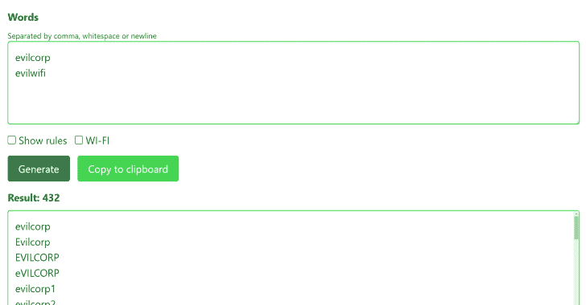
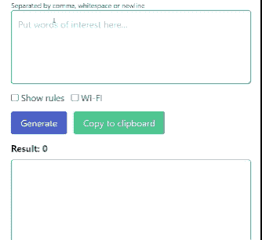

# Weakpass:基于规则的在线生成器，根据一组单词创建单词列表

> 原文：<https://kalilinuxtutorials.com/weakpass/>

Weakpass 是一个基于用户输入的一组单词生成单词列表的工具。

例如，在渗透测试期间，您需要访问一些受密码保护的服务、设备、帐户或 Wi-Fi 网络。比如说，让它成为 **EvilCorp** 的 *Wi-Fi* 网络。有时，密码是由*设备/网络/组织*名称和一些日期、特殊字符等组合而成。因此，在启动更复杂和耗时的检查之前，测试一些组合会更简单和容易。例如，用单词列表破解 *Wi-Fi* 密码可能需要几个小时，而且可能会失败，即使你选择了一个很棒的单词列表，因为其中没有像 **Evilcorp2019** 这样的密码。

因此，使用生成的单词列表，可以组织有针对性的和有效的在线密码检查。

链接:https://zzzteph.github.io/weakpass/

中学:https://weakpass.com/generate

**特色**

hashcat 规则语法用于生成单词列表。默认情况下，生成器使用一组规则“online.rule ”,执行以下变化:

*   在单词末尾添加特殊字符和流行的结尾-！,!@, !@#, 123!等等。 **evilcorp！**， **evilcorp！123**
*   从 1 到 31，从 01 到 12 的数字相加-**evil corp 01**， **evilcorp12** 。
*   增加日期 2018-2023-**evil corp 2018**， **evilcorp2019**
*   1-3-**各种组合 evilcorp2018！**
*   第一个字母大写，其余的小写，应用 1-4。 **Evilcorp！2021 年**

因此，对于单词 **evilcorp** ，将生成以下密码(总共 216 个):

*   evilcorp
*   Evilcorp
*   EVILCORP
*   evilcorp123456
*   evilcorp2018
*   邪恶集团。2021
*   邪恶军团。2022
*   Evilcorp2018！@#

您可以使用自己的 hashcat 规则，只需点击**“显示规则”**，将它们与您最喜欢的规则列表一起放入**“规则”**文本区。支持的规则(来源 https://hashcat.net/wiki/doku.php?id=rule_based_attack):

| 名字 | 功能 | 描述 | 示例规则 | 输入字 | 输出字 |
| --- | --- | --- | --- | --- | --- |
| 没有任何东西 | ： | 什么都不做(通过) | ： | p@ssW0rd | p@ssW0rd |
| 小写字母 | l | 小写所有字母 | l | p@ssW0rd | p@ssw0rd |
| 大写字母 | u | 全部大写字母 | u | p@ssW0rd | P@SSW0RD |
| 大写 | c | 第一个字母大写，其余的小写 | c | p@ssW0rd | P@ssw0rd |
| 反转大写 | C | 小写的第一个找到的字符，大写的其余 | C | p@ssW0rd | p@SSW0RD |
| 切换案例 | t | 切换 word 中所有字符的大小写。 | t | p@ssW0rd | P@SSw0RD |
| 切换@ | 长吨 | 切换 N 位置字符的大小写 | T3 | p@ssW0rd | p@sSW0rd |
| 反面的 | r | 颠倒整个单词 | r | p@ssW0rd | dr0Wss@p |
| 复制 | d | 复制整个单词 | d | p@ssW0rd | p@ssW0rdp@ssW0rd |
| 复制 | 期票 | 将重复的单词追加 N 次 | p2 | p@ssW0rd | p@ssW0rdp@ssW0rdp@ssW0rd |
| 显示 | f | 重复单词已反转 | f | p@ssW0rd | p@ssW0rddr0Wss@p |
| 左旋 90 度 | { | 向左旋转单词。 | { | p@ssW0rd | @ssW0rdp |
| 右旋 90 度 | } | 向右旋转单词 | } | p@ssW0rd | dp@ssW0r |
| 附加字符 | $X | 将字符 X 追加到末尾 | $1 | p@ssW0rd | p@ssW0rd1 |
| 前置字符 | X | 将字符 X 前置到前面 | ^1 | p@ssW0rd | 1p@ssW0rd |
| 向左截断 | [ | 删除首字符 | [ | p@ssW0rd | @ssW0rd |
| 向右截断 | ] | 删除最后一个字符 | ] | p@ssW0rd | p@assW0r |
| 删除@ N | （同 down）向下的 | 删除位置 N 的字符 | D3 | p@ssW0rd | p@sW0rd |
| 提取范围 | xNM | 提取 M 个字符，从位置 N 开始 | x04 | p@ssW0rd | p@ss |
| 省略范围 | ONM | 删除 M 个字符，从位置 N 开始 | O12 | p@ssW0rd | psW0rd |
| 插入@ N | iNX | 在位置 N 插入字符 X | i4！ | p@ssW0rd | p@ss！W0rd |
| 覆盖@ N | oNX | 用 X 覆盖位置 N 的字符 | o3 美元 | p@ssW0rd | p@s$W0rd |
| 截断@ N | 普通 | 在位置 N 截断单词 | ‘6 | p@ssW0rd | p@ssW0 |
| 替换 | sXY | 用 Y 替换 X 的所有实例 | ss 美元 | p@ssW0rd | p@美元$世界 |
| 净化 | @X | 清除 X 的所有实例 | @s | p@ssW0rd | p@W0rd |
| 复制第一个 N | 锌 | 将第一个字符重复 N 次 | z2 | p@ssW0rd | ppp@ssW0rd |
| 重复最后一个 N | 锌 | 重复最后一个字符 N 次 | Z2 | p@ssW0rd | p@ssW0rddd |
| 全部复制 | q | 复制每个字符 | q | p@ssW0rd | pp@@ssssWW00rrdd |

生成器会自动删除重复的密码。

按下 Wi-Fi，所有少于 8 个字符的密码将被自动删除。

所有数据都是使用 Javascript 生成的，因此您可以在不访问互联网的情况下使用生成器。

**

*   要生成单词列表，在**单词**字段中输入可用作密码一部分的单词。
*   点击**生成**按钮
*   复制收到的内容或点击复制到剪贴板按钮进行自动复制。
*   …
*   利润！

[**Download**](https://github.com/zzzteph/weakpass)**