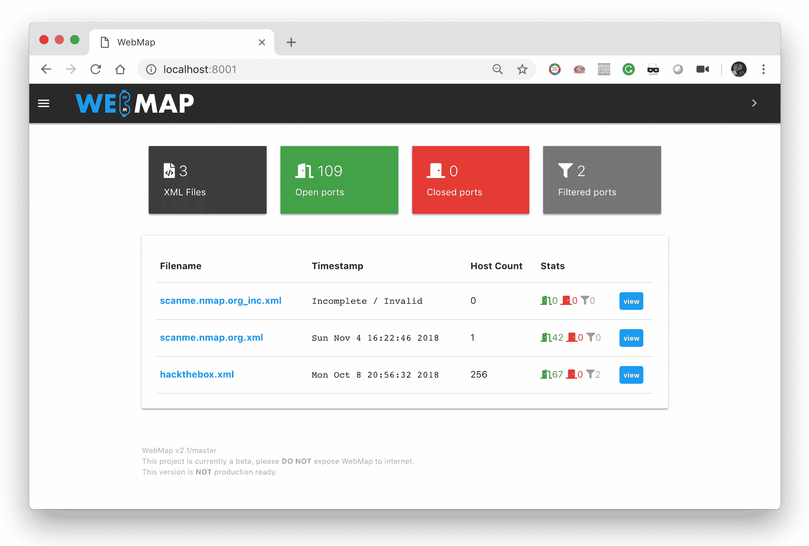
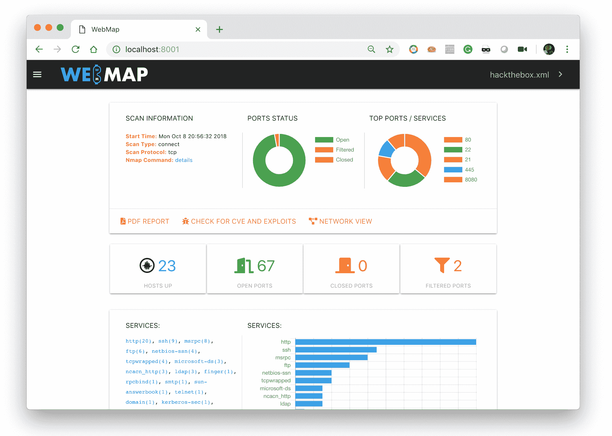
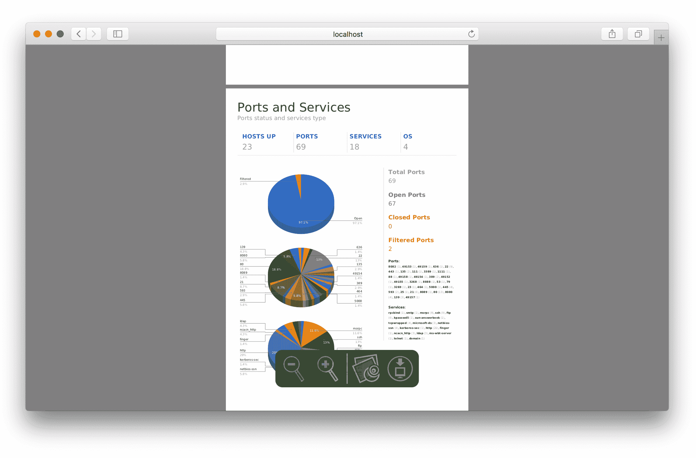
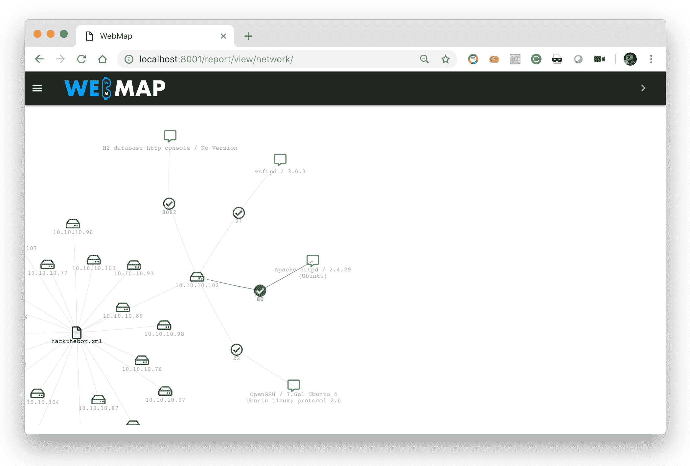

# 网络地图:网络地图网络仪表板和报告

> 原文：<https://kalilinuxtutorials.com/webmap-nmap/>

WebMap 项目被设计为运行在带有**[Nmap](https://gbhackers.com/information-gatheri-using-nmap/)**Web Dashboard 的 Docker 容器上。依我看，在一个定制的 Django 系统上运行这个并不是一个好主意。

 

**又读[Docker-Inurlbr:Exploit GET/POST 抓取邮件&URL](https://kalilinuxtutorials.com/docker-inurlbr-emails-urls/)**

## **webap 用途**

您应该在 docker 中使用它，只需发送以下命令:

```
$ mkdir /tmp/webmap
$ docker run -d \
         --name webmap \
         -h webmap \
         -p 8000:8000 \
         -v /tmp/webmap:/opt/xml \
         rev3rse/webmap

$ # now you can run Nmap and save the XML Report on /tmp/webmap
$ nmap -sT -A -T4 -oX /tmp/webmap/myscan.xml 192.168.1.0/24
```

现在将你的浏览器指向 [http://localhost:8000](http://localhost:8000)

### **又快又脏**

```
$ curl -sL http://bit.ly/webmapsetup | bash
```

### **从先前版本升级**

```
$ # stop running webmap container
$ docker stop webmap

$ # remove webmap container
$ docker rm webmap

$ # pull new image from dockerhub
$ docker pull rev3rse/webmap

$ # run WebMap
$ curl -sL http://bit.ly/webmapsetup | bash
```

## **视频教程**

HTML 模板经常变化。此视频无法与最新版本保持同步。

## **PDF 报告**



## **XML 文件名**

创建 PDF 版本的 Nmap XML 报告时，XML 文件名用作第一页上的文档标题。WebMap 将替换文件名的某些部分，如下所示:

*   `_`将替换为空格()
*   `**.xml**`将被删除

示例:`**ACME_Ltd..xml**`
PDF 标题:`**ACME Ltd.**`

## **CVE &营业**

感谢 circl.lu 提供的令人惊叹的 API 服务，WebMap 能够查找 Nmap 收集的每个 CPE 的 CVE 和漏洞。并不是所有的 CPE 都通过 circl.lu API 进行检查，而是只有在指定了特定版本的情况下才进行检查(例如:`**cpe:/a:microsoft:iis:7.5**`而不是`**cpe:/o:microsoft:windows**`)。

## **网络视图**



## **RESTful API**

从`**v2.1**`开始，WebMap 有一个 RESTful API 前端，使用户能够使用类似以下的内容查询他们的扫描文件:

```
curl -s 'http://localhost:8000/api/v1/scan'

    "webmap_version": "v2.1/master",
    "scans": {
        "scanme.nmap.org.xml": {
            "filename": "scanme.nmap.org.xml",
            "startstr": "Sun Nov  4 16:22:46 2018",
            "nhost": "1",
            "port_stats": {
                "open": 42,
                "closed": 0,
                "filtered": 0
            }
        },
        "hackthebox.xml": {
            "filename": "hackthebox.xml",
            "startstr": "Mon Oct  8 20:56:32 2018",
            "nhost": "256",
            "port_stats": {
                "open": 67,
                "closed": 0,
                "filtered": 2
            }
        }
    }
}
```

用户可以通过在 URL 后面附加 XML 文件名来获取有关单次扫描的信息:

```
curl -v 'http://localhost:8000/api/v1/scan/hackthebox.xml'

{
    "file": "hackthebox.xml",
    "hosts": {
        "10.10.10.2": {
            "hostname": {},
            "label": "",
            "notes": ""
        },
        "10.10.10.72": {
            "hostname": {
                "PTR": "streetfighterclub.htb"
            },
            "label": "",
            "notes": ""
        },
        "10.10.10.76": {
            "hostname": {},
            "label": "",
            "notes": ""
        },
        "10.10.10.77": {
            "hostname": {},
            "label": "Vulnerable",
            "notes": "PHNwYW4gY2xhc3M9ImxhYmVsIGdyZWVuIj5SRU1FRElBVElPTjwvc3Bhbj4gVXBncmFkZSB0byB0aGUgbGF0ZXN0IHZlcnNpb24g"
        },
...
```

他可以通过将 IP 地址附加到 URL 来获得关于单个主机的所有信息:

```
curl -v'http://localhost:8000/api/v1/scan/hackthebox.xml/10.10.10.87'

    "file": "hackthebox.xml",
    "hosts": {
        "10.10.10.87": {
            "ports": [
                {
                    "port": "22",
                    "name": "ssh",
                    "state": "open",
                    "protocol": "tcp",
                    "reason": "syn-ack",
                    "product": "OpenSSH",
                    "version": "7.5",
                    "extrainfo": "protocol 2.0"
                },
                {
                    "port": "80",
                    "name": "http",
                    "state": "open",
                    "protocol": "tcp",
                    "reason": "syn-ack",
                    "product": "nginx",
                    "version": "1.12.2",
                    "extrainfo": ""
                },
                {
                    "port": "8888",
                    "name": "sun-answerbook",
                    "state": "filtered",
                    "protocol": "tcp",
                    "reason": "no-response",
                    "product": "",
                    "version": "",
                    "extrainfo": ""
                }
            ],
            "hostname": {},
            "label": "Checked",
            "notes": "",
            "CVE": [
                {
                    "Modified": "2018-08-17T15:29:00.253000",
                    "Published": "2018-08-17T15:29:00.223000",
                    "cvss": "5.0",
                    "cwe": "CWE-200",
                    "exploit-db": [
                        {
                            "description": "OpenSSH 7.7 - Username Enumeration. CVE-2018-15473\. Remote exploit for Linux platform",
                            "file": "exploits/linux/remote/45233.py",
                            "id": "EDB-ID:45233",
                            "last seen": "2018-08-21",
                            "modified": "2018-08-21",
                            "platform": "linux",
                            "port": "",
                            "published": "2018-08-21",
                            "reporter": "Exploit-DB",
                            "source": "https://www.exploit-db.com/download/45233/",
                            "title": "OpenSSH 7.7 - Username Enumeration",
                            "type": "remote"
                        },
                        {
                            "id": "EDB-ID:45210"
                        }
                    ],
                    "id": "CVE-2018-15473",
                    "last-modified": "2018-11-02T06:29:06.993000",
                    "metasploit": [
...
```

## **安全问题**

此应用程序不打算在互联网上公开。请，**不要将**这个应用程序暴露在互联网上，使用您的本地主机，或者，如果您不能这样做，请注意使用防火墙规则或类似的规则来过滤谁和什么可以访问 WebMap。将此应用程序暴露给整个互联网不仅会导致存储的 XSS，还会导致关于您的端口扫描的敏感/关键/私人信息的泄露。拜托，放聪明点。

[ ](https://github.com/Rev3rseSecurity/WebMap) **信用: [Menin_TheMiddle](https://twitter.com/Menin_TheMiddle)**