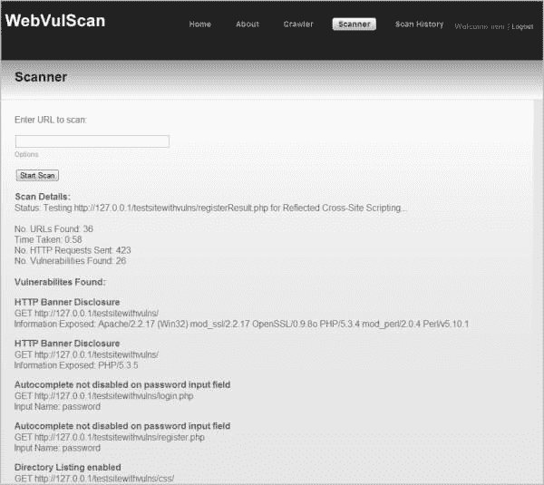

# WebvulScan–Web 应用程序漏洞扫描器

> 原文：<https://kalilinuxtutorials.com/webvulscan-vulnerability-scanner/>

**WebVulScan** 是一款 web 应用漏洞扫描器。它是一个用 PHP 编写的 web 应用程序，可以用来测试远程或本地 web 应用程序的安全漏洞。扫描运行时，扫描的详细信息会动态更新给用户。这些详细信息包括扫描状态、在 web 应用程序上发现的 URL 数量、发现的漏洞数量以及发现的漏洞的详细信息。

扫描完成后，将通过电子邮件向用户发送一份详细的 PDF 报告。该报告包括对发现的漏洞的描述、建议以及每个漏洞被利用的位置和方式的详细信息。

**也可阅读[SIPI——用于信誉数据分析的简单 IP 信息工具](https://kalilinuxtutorials.com/sipi-simple-ip-information-tools/)**

**WebVulScan 测试的漏洞有:**

*   反射式跨站点脚本
*   存储的跨站点脚本
*   标准 SQL 注入
*   使用 SQL 注入的身份验证被破坏
*   对密码字段启用自动完成
*   潜在不安全的直接对象引用
*   目录列表已启用
*   HTTP 横幅披露
*   SSL 证书不可信
*   未验证的重定向

**特性:**

*   爬虫:抓取一个网站来识别和显示所有属于该网站的 URL。
*   扫描程序:抓取网站并扫描所有发现漏洞的 URL。
*   扫描历史记录:允许用户查看或下载他们以前执行的扫描的 PDF 报告。
*   Register:允许用户向 web 应用程序注册。
*   登录:允许用户登录到 web 应用程序。
*   选项:允许用户选择要测试的漏洞(默认情况下全部启用)。
*   PDF 生成:动态生成详细的 PDF 报告。
*   报告交付:PDF 报告作为附件通过电子邮件发送给用户。

