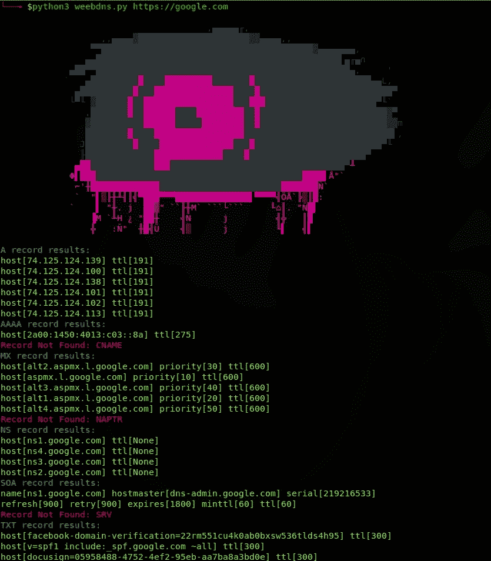

# Weebdns:异步的 dns 枚举

> 原文：<https://kalilinuxtutorials.com/weebdns-dns-enumeration-asynchronicity/>

**WeebDNS** 是一个具有异步性的 DNS 枚举工具。

**免责声明**:这仅用于测试目的，并且只能在获得严格同意的情况下使用。不要将此用于非法目的，句号。

**特性**

这是一个用 Python3 制作的'**异步** ' DNS 枚举工具，比普通工具快得多。

**先决条件**

*   Python 3.x
*   pip3
*   饭桶

**PYTHON 3 先决条件**

*   aiohttp
*   asyncio
*   阿多尼斯

**也可以理解为-[Pyattck:一个 Python 模块，用于与米特 ATT & CK 框架](https://kalilinuxtutorials.com/pyattck-python-module-mitre-attck-framework/)进行交互**

**安装**

**解析依赖关系**

**Ubuntu/Debian 系统**

**$ sudo apt-get 安装 git python3 python3-pip -y**

**获取并运行**

**$ git 克隆 https://github.com/WeebSec/weebdns.git
$ CD wee bdns
$ sudo pip 3 install-r requirements . txt
$ python 3 wee bdns . py**

**截图**

[Download](https://github.com/WeebSec/weebdns)