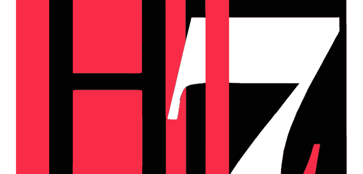

# HL7 是什么，为什么医疗保健需要它？

> 原文：<https://kalilinuxtutorials.com/what-is-hl7-and-why-does-healthcare-need-it/>

如果您已经在医疗保健行业工作了一段时间，您可能会同意系统之间的互操作性已经成为当今的普遍问题之一。

您是否知道仅在美国，每年的互操作性成本就高达 300 亿美元？这是因为这些组织中的大多数都花了很多钱来雇人处理大数据。事实上，所有这些组织都能借助 HL7 技术解决问题吗？

对于提供商和客户来说，数据交换一直是一项具有挑战性的任务。数据错误随时可能发生，尤其是在不同的软件和应用程序之间传输数据时。

假设一个医疗机构从系统、医疗设备和其他工具中积累了重要信息。记录应该在那里。但是，当他们需要将记录与其他设备、解决方案或系统集成时，存在巨大的出错和误解风险。

对于这些组织来说，这个过程既麻烦又昂贵。更不用说病人在使用医疗服务来治疗自己时会有巨大的失败。

这种情况在很多国家经常发生。我们不仅讨论发展中国家的情况，也讨论大国的情况。

像 HL7 国际这样的非营利组织已经意识到了这个问题。他们提出了 HL7，这是一套可以永久解决问题的标准。事实上，ANSI——美国国家标准协会和 IOS——国际标准化组织都支持这套新协议。

## **[HL7](https://gloriumtech.com/what-is-hl7-and-why-does-your-healthcare-product-need-it/)是什么，它的重点是什么？**

HL7 其实是健康等级 7 的缩写。这是一套在医疗保健解决方案和软件以及应用程序中与不同提供商交换数字信息的规则。由于对互操作性的高度需求，这些协议越来越受欢迎。

这些协议可以有效地指导医疗保健数据提供商将其集成到他们现有的软件中，以便他们可以顺利地与替代提供商或组织直接通信，而不会出现任何问题。

请记住，医疗保健领域的 hl7 不是一个平台或软件。更确切地说，它是一个规范，规定了在组织之间提供的健康相关产品的质量。

在这组框架中，相关方可以看到他们需要应用的许多准则和方法，以便与其他方进行交互。

对于临床文档和记录，每个参与者或用户都要遵守相关的规定和规则。传输的数据类型可以是手术文档、临床文档、患者健康记录等等。在这种情况下，七级国际卫生组织将确保信息的形式在不同的展台保持准确和全面。标准集本身对错误和误解零容忍。

## **医疗保健 HL7 标准**

对所有供应商来说，这是一个很好的选择吗？你一定有一些问题。看来，健康七级国际非盈利公司在向世界部署这一特殊的突破之前，已经考虑得很清楚了。HL7 技术中的标准可以应用于所有 EHR 和所有软件中。格式化的消息是与内部 EHR 之外的其他平台进行交互的简单方式。当使用这个解决方案来传递信息时，人们可以放心，他们共享的数据在到达另一个系统时将保持一致。

单就事实而言，它是如此真实，以至于提供商不需要花钱从零开始构建系统。事实上，您可以将这些协议添加到您现有的软件中。

软件用户将需要连接到基于 FHIR 的应用程序接口或 API 以使其工作。API 允许 HL7 技术保持健康相关产品记录保持不变。这意味着其他解决方案也可以毫无问题地读取数据。

## **医疗服务提供者之间的信息交换**

尽管 HL7 附带了一套标准，但它并不仅仅意味着直接管理软件以使过程自动化。相反，它提供了一个指南或一组规则，软件需要使用这些规则来管理数据，并准备在不同的应用程序和开发之间进行解释。

有三个主要的 HL7 标准版本:V2、V3 和基于 XML 的 FHIR。

V2 是允许不同平台之间进行数据交易的标准集。信息的类型是临床数据。大多数组织一直在利用 V2，包括用于国际信息交流。

同时，V3 是 HL7 的 RIM 建议的规范。为了实现如此高水平的实现，执行者需要遵循推荐的消息、数据类型以及特定的术语。

基于 XML 的 FHIR 是关注 V2 和 V3 标准的最佳选择。它关注独特的解决方案和平台内的可实现性。它可以允许实现者在如此多的不同层次上实现解决方案。

## **定制 HL7 接口软件解决方案**

自定义 HL7 接口软件通常是比其他应用程序好得多的解决方案，因为它确保了与 Hl7 规则集的准确努力的互操作性。

Glorium Tech 是一个与更新医疗保健软件相关的名称，该软件集成了包括 HL7 技术在内的重要功能。这是一个不可思议的开发公司，他们有经验和专业知识来为客户遵守和管理软件中的 HL7 接口。他们由技术娴熟、才华横溢的开发人员组成，准备利用 HL7 组件的潜力来帮助软件处理不同应用程序和软件中的数据。

拥有 HL7 多功能解决方案将赋予您巨大的能力，包括降低运营成本和周转时间，确保各种系统和解决方案之间的数据重要性和一致性，同时监控整个系统，等等。