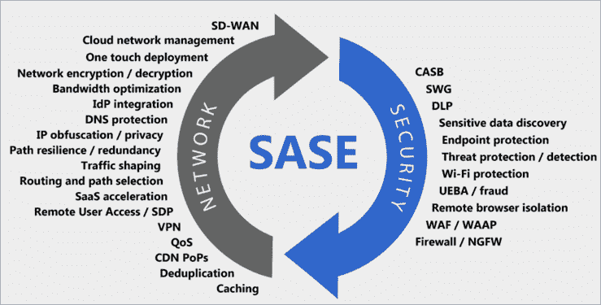

# 什么是 SASE，它可以防止哪些安全威胁？

> 原文：<https://kalilinuxtutorials.com/what-is-sase-and-what-security-threats-can-it-prevent/>

SASE 代表安全接入服务边缘，是一种基于云的网络安全模型。SASE 使用一种称为软件定义的网络的技术，该技术允许软件管理网络，并将它们与网络安全功能相结合。 [SASE 通过为组织提供单一服务提供商，简化了网络基础设施](https://www.catonetworks.com/sase/)和安全管理。

这种基于云的安全模型是由 Gartner 在 2019 年 8 月提出的。它允许组织实施安全访问策略，而不管其物理位置如何。SASE 架构可识别请求访问的用户和设备，实施基于策略的安全性和合规性，并为用户提供安全的访问。

传统的网络基础架构使用轴辐式模型，它将多个位置的用户连接到集中数据中心托管的资源。所有数据和应用程序都驻留在这个核心数据中心，用户可以通过本地专用网络或 VPN 进行连接，具体取决于组织的网络配置。

这种传统模式的问题在于，它与不断发展的技术和文化不兼容。安全即服务(SaaS)增加了这种模式的复杂性，因为它需要更多的维护和监控。此外，随着越来越多的远程员工居住在不同的位置，这种中心辐射型模式变得不切实际，增加了关键应用程序和远程用户的延迟。

另一方面，SASE 在云边缘执行网络控制，而不是将数据中心用作所有存储和流量的主要枢纽。这简化了网络和安全服务，不需要 VPN，并限制了延迟。凭借内置的安全性和单一监控平台，SASE 是配置网络基础设施的一种更简单、更安全的方式。

## **SASE 的主要组成部分**

### **云接入安全代理(CASB)**

CASB 充当用户和云应用之间的桥梁。它们允许组织对所有云应用程序应用安全策略、双因素身份认证(TFA)和单点登录(SSO)，防止未经授权的设备和个人访问敏感资产，并拒绝未经授权方的访问。

### **零信任网络访问(ZTNA)**

ZTNA 是下一代访问控制系统，确保每个用户或设备都有访问应用程序或资源的明确权限。它强制实施零信任安全模型，并确保在网络中运行的应用程序对无权访问它们的用户隐藏。它还通过分层身份验证实现了安全的远程访问。ZTNA 提供了适用于敏捷组织的高适应性安全性。

### **软件定义的广域网(SD-WAN)**

SD-WAN 是一种连接架构，将网络硬件与物理控制层分开。它通过提高广域网性能和简化管理来提高网络性能。SD-WAN 支持由数字化转型驱动的新应用和服务，尤其是基于云的环境。将 SD-WAN 与高级安全功能相结合，为企业过渡到 SASE 奠定了基础。

### **安全网络网关(SWG)**

SWG 保护连接的设备免受攻击，强制执行公司政策，并从用户发起的互联网流量中过滤恶意软件。SWG 提供 URL 过滤、应用程序控制、DLP、防病毒、沙盒和 SSL 检查，以保护用户不查看有害网站并执行安全策略，同时确保对合法资源的完全 web 访问。

### **防火墙即服务(FWaaS)**

FWaaS 是作为基于云的服务交付的防火墙解决方案。它提供下一代防火墙(NGFW)功能，包括网页过滤、高级威胁防护(ATP)、入侵防御系统(IPS)和 DNS 安全性。通过将 FWaaS 集成到 SASE 平台中，SASE 可以为在任何位置运行的任何工作负载提供网络安全功能。

### **集中统一管理**

现代化的 SASE 平台使 IT 管理员能够通过跨网络和安全性的集中统一管理来管理 SD-WAN、SWG、CASB、FWaaS 和 ZTNA。这提高了安全性，并为组织的混合员工带来了更好的用户体验。

## 它可以防止哪些安全威胁？

### **代码和 SQL 注入攻击**

许多网站接受用户输入，但不验证和净化输入。然后，攻击者可以填写表单或进行 API 调用，传递恶意代码而不是预期的数据值。该代码在服务器上运行，允许攻击者执行恶意活动，在许多情况下会危及整个主机。

**SASE 如何防止这种威胁:** SASE 有几个组件可以过滤应用流量，搜索攻击模式。其中包括 SWG 和 FWaaS。有几个防御层可以识别可能的攻击模式，如 [SQL 注入](https://owasp.org/www-community/attacks/SQL_Injection)攻击，并实时阻止它们。

### **内部威胁**

网络特别容易受到已经可以访问组织系统的恶意内部人员的攻击。内部威胁可能难以检测和防御，因为他们已经在网络内部，并且可能已经拥有敏感系统的权限。用户和事件行为分析(UEBA)等新技术有助于识别内部人员的可疑或异常行为，并检测内部攻击。

【SASE 如何防止这种威胁:与上一节类似，零信任安全的主要目标之一是防止内部威胁。SASE 使用 ZTNA 持续验证所有请求，包括来自内部可信来源的请求。通过这种方式，可以立即检测并阻止内部人员滥用他们的特权来执行异常活动。

### **未授权访问**

未授权访问是指攻击者未经授权访问您的网络。未授权访问攻击的原因包括弱密码强度、缺乏对社会工程的保护、以前被攻破的帐户和内部威胁。

**SASE 如何防止这种威胁:** SASE 包括 ZTNA，它执行强认证，可以识别和阻止异常访问请求。

### **分布式拒绝服务(DDoS)攻击**

攻击者创建僵尸网络，即大量被入侵的设备，并利用它们向网络或服务器发送虚假流量。DDoS 可能发生在网络层，例如，通过发送大量 SYN/ACC 数据包使服务器不堪重负。它也可能发生在应用程序级别，例如，通过使用大量复杂的 SQL 查询访问数据库。

**SASE 如何防止这种威胁:**SASE 的组件之一是 FWaaS，这是一种在边缘运行的防火墙，可以识别网络层或应用层 DDoS 并阻止它。

### **中间人攻击**

在中间人(MitM)攻击中，攻击者拦截您的网络与外部站点之间或您的网络内部的流量。如果通信协议不安全，或者攻击者找到了绕过其安全性的方法，他们可以窃取传输中的数据，获取用户凭据，并劫持会话。

**SASE 如何防止这种威胁:** SASE 在默认情况下加密所有流量，防止大多数中间人威胁矢量。

### **权限提升**

如果攻击者进入您的网络，他们可以使用权限提升来扩大他们的影响范围。水平权限提升涉及攻击者获得另一个相邻系统的访问权限，而垂直权限提升意味着攻击者获得同一系统的更高权限。

**SASE 如何防止这种威胁:**SASE 的基本原则之一是实施零信任安全模型，在该模型中，每个用户或实体都拥有履行其角色所需的最低权限。当用户试图提升权限时，ZTNA 会检查更高的权限是否有保证，如果没有，就会阻止请求。

## **结论**

总之，SASE 是一种相对较新的技术，旨在为网络和安全性提供一种安全的集成方法。通过将多种安全功能(如 VPN、防火墙和内容过滤)结合到一个基于云的服务中，该服务通过边缘位置的全球网络提供，SASE 使组织能够轻松、安全地将用户连接到内部和云中的应用程序和资源。

此外，SASE 能够抵御各种安全威胁，包括恶意软件、SQL 注入攻击和内部威胁。通过提供单一的网络和安全平台，SASE 帮助组织改善其整体安全状况，更好地抵御现代网络威胁。