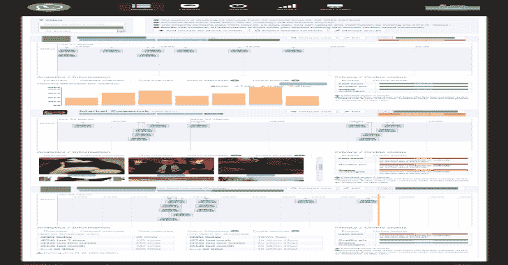
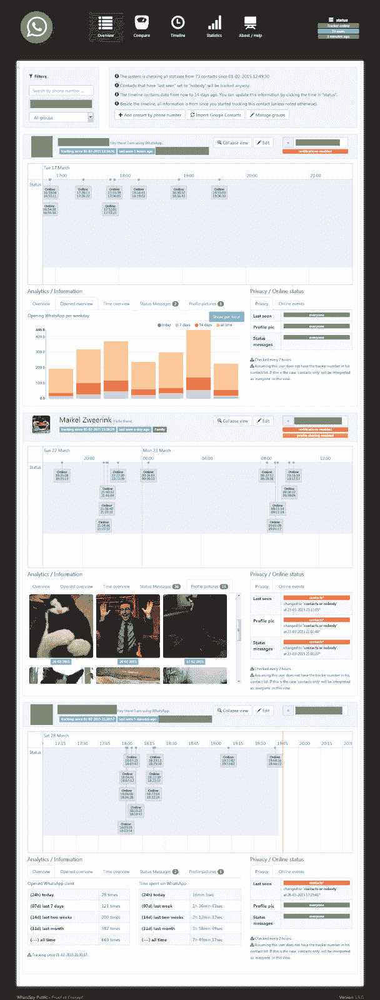
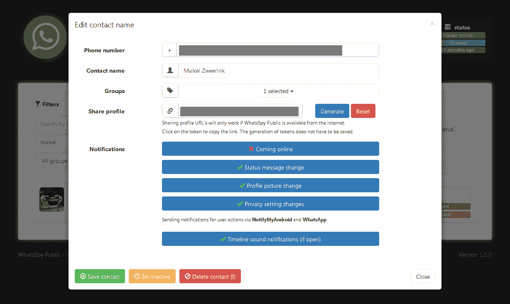
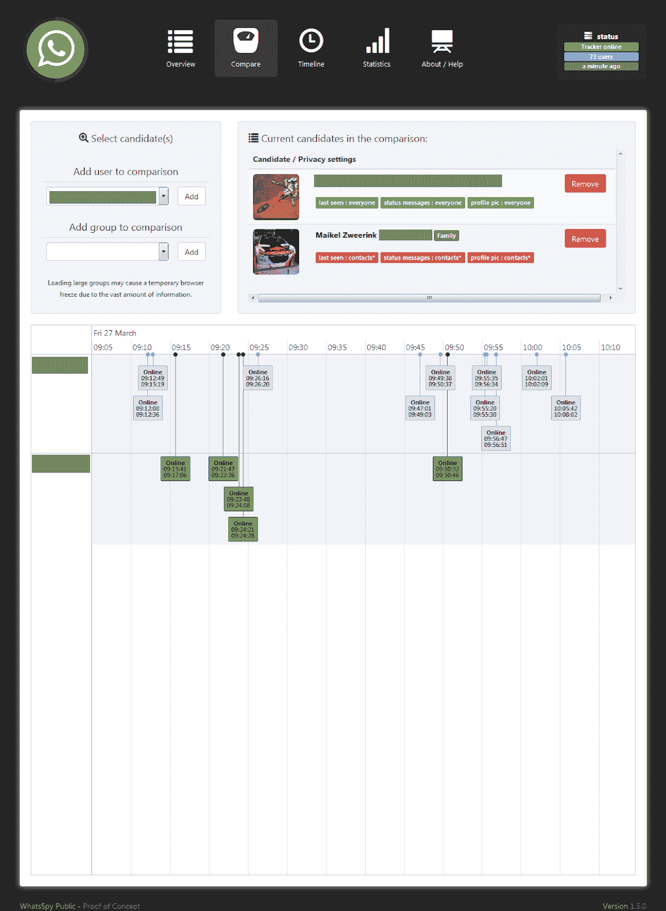
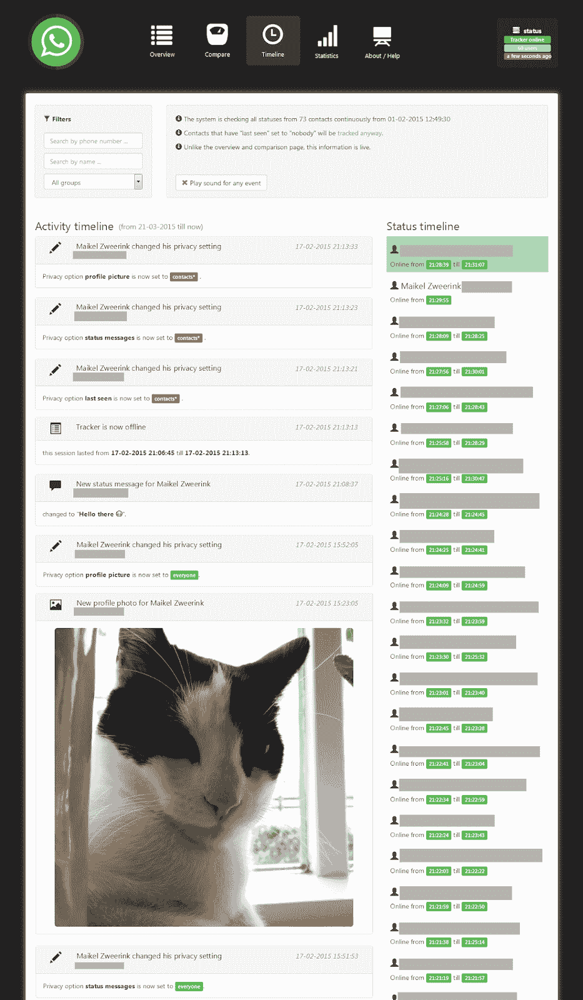
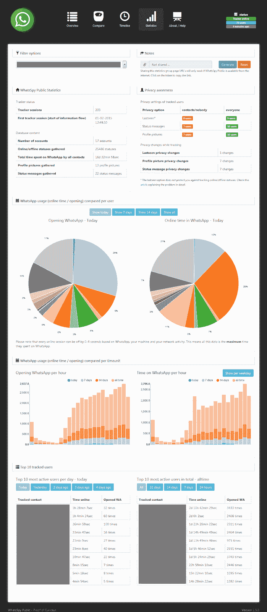
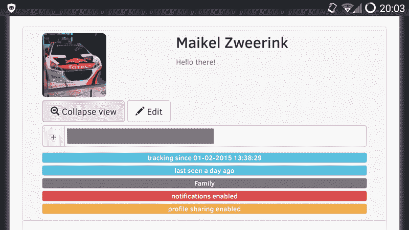

# WhatsSpy:追踪 WhatsApp 用户的行动

> 原文：<https://kalilinuxtutorials.com/whatsspy/>

Public(不要与 whats py 混淆)是一个面向网络的应用程序，可以追踪你喜欢关注的人在 WhatsApp 上的一举一动(只需知道他们的电话号码)。

这个应用程序被设置为 WhatsApp 在隐私方面被破坏的概念证明。它跟踪以下活动:

*   在线/离线状态 **[(即使隐私选项设置为“无人”)](https://maikel.pro/blog/en-whatsapp-privacy-problem-explained-in-detail/)**
*   个人资料图片*
*   状态消息*
*   隐私设置

【WhatsSpy 公众能做什么？

不管你喜不喜欢，都可以描述一下你的日常习惯和一整天的智能手机使用情况。

它包含以下功能:

*   跟踪用户状态/状态消息和个人资料图片(历史)。
*   跟踪任何隐私设置更改。
*   如果用户在 WhatsApp 中上线/更改了上述任何内容，将通过各种服务得到通知。
*   比较用户状态以得出结论。
*   像脸书一样获得关于被跟踪用户的时间轴视图。
*   将所有被跟踪的用户分组并查看他们的统计信息。
*   通过独特的令牌共享个人资料。
*   全语言支持英语、德语、西班牙语、荷兰语

**也可阅读-[XSS con:简单的 XSS 扫描仪工具](https://kalilinuxtutorials.com/xsscon/)**

**安装**

设置 WhatsSpy Public 需要一些 IT 知识，你可能还需要一张 SIM 卡。有普通的和 Raspberry Pi 镜像安装视频。

您有三个选项来设置 WhatsSpy Public:

*   **普通** : [在现有的 Linux 机器上设置 whats py Public(Ubuntu/Debian)/VPS(Linux)/Raspberry Pi](/maikeldus/WhatsSpy-Public/wikis/getting-started)。
*   **Raspberry Pi 图像** : [使用已经有 WhatsSpy Public 的 Raspberry Pi 图像](/maikeldus/WhatsSpy-Public/wikis/getting-started-rpi-image)。
*   **QEMU** 在 Ubuntu [上使用模拟器 QEMU 搭配树莓 pi 镜像阅读体验](https://gitlab.maikel.pro/maikeldus/WhatsSpy-Public/issues/200#note_1359)。

有关更新，请查看[更新日志以及如何更新](/maikeldus/WhatsSpy-Public/wikis/updates)。

**截图**

**概述**

**概览编辑联系人**

**比较**

**时间线**

**统计数据**

**而且还是移动的(钉住网页，不是 APK)！**

固定在安卓手机主屏幕上的外部安装

[**Download**](https://gitlab.maikel.pro/maikeldus/WhatsSpy-Public/wikis/home)