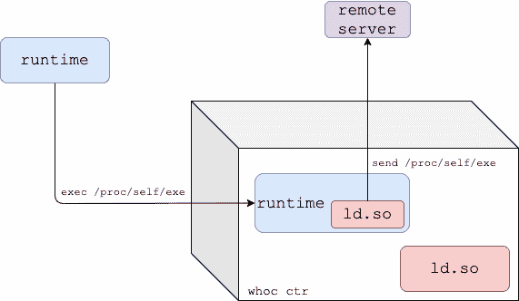

# Whoc:提取底层容器运行时的容器映像

> 原文：<https://kalilinuxtutorials.com/whoc-2/>

Whoc 是一个容器映像，它提取底层的容器运行时，并将其发送到远程服务器。戳一下你喜欢的 CSP 容器平台的底层容器运行时！

*   世界卫生组织在 29 号防御云村
*   Azur escape——whoc 支持的研究，公共云中的第一个跨帐户容器接管(70，000 美元奖金)

**它是如何工作的？**

如 runc CVE-2019-5736 所示，传统的 Linux 容器运行时通过 **`/proc/self/exe`将自己暴露给正在运行的容器。`whoc`** 使用这个链接来读取执行它的容器运行时。

**动态模式**

这是针对动态链接容器运行时的默认模式。

*   `**whoc**`图像入口点设置为`**/proc/self/exe**`，图像的动态链接器(`**ld.so**`)替换为`**upload_runtime**`。
*   一旦映像运行，容器运行时将在容器内重新执行自身。
*   假设运行时是动态链接的，内核将我们的假动态链接器(`**upload_runtime**`)加载到运行时进程，并将执行传递给它。
*   `**upload_runtime**`通过`/**proc/self/exe**`读取运行时二进制，并发送给配置好的远程服务器。

**等待执行模式**

对于静态链接的容器运行时，`**whoc**`有另一种风格:`**whoc:waitforexec**`。

*   `**upload_runtime**`是图像入口点，作为`**whoc**`容器 PID 1 运行。
*   用户应该执行到`**whoc**`容器中，并调用一个指向`**/proc/self/exe**`的文件(例如 **`docker exec whoc_ctr /proc/self/exe`)。**
*   一旦 exec 发生，容器运行时就在容器内部重新执行自己。
*   `**upload_runtime**`通过`**/proc/$runtime-pid/exe**`读取运行时二进制，并发送给配置好的远程服务器。

**尝试本地**

你需要安装`**docker**`和`**python3**`。克隆存储库:

**$ git 克隆 git @ github . com:twistlock/whoc . git**

设置文件服务器以接收提取的容器运行时:

**$ CD whoc
$ mkdir-p stash&&CD stash
$ ln-s../util/fileserver.py 文件服务器
$。/文件服务器**

从另一个 shell，在您选择的容器环境中运行`**whoc**`映像，例如 Docker:

**$ CD whoc
$ docker build-f docker file _ dynamic-t whoc:最新的 src # or。/util/build . sh
$ docker run–RM-it–net = host whoc:最新 127.0.0.1 #或。/util/run_local.sh**

查看文件服务器收到了容器运行时。如果在 vanilla Docker 下运行`**whoc**`，收到的容器运行时应该是 runc。

*`**--net=hos**t`仅在本地测试中使用，这样`**whoc**`容器可以通过 **`127.0.0.1`轻松到达主机上的文件服务器。***

**其他平台**

默认情况下，`w**hoc**`是为`**linux/amd64**`构建的，但它也支持其他 CPU 架构。等待执行模式可以照常构建。为了在动态模式下为其他 CPU 架构构建`**whoc**`，您必须用目标架构上的动态链接器的路径填充`**PLATFORM_LD_PATH_ARG**`构建参数。

在`**util/build_arm64.sh**`上有一个`**arm64**`的示例构建脚本。

**求助**

帮助**为`whoc`的**主双星，`**upload_runtime**`:

用法:upload _ runtime[选项]

**选项:
-p，–远程服务器的端口 port，默认为 8080
-e，–exec Wait-for-exec 模式用于静态容器运行时，等待直到容器的 exec 发生
-b，–exec-bin 在 exec 模式下，覆盖为 exec 创建的默认二进制文件，默认为/bin/enter
-a，–exec-extra-argument 在 exec 模式下，向运行时传递一个额外的参数，使其不会快速退出【T5-r，–exec-readdir-proc 在 exec 模式下**

[**Download**](https://github.com/twistlock/whoc)