# WiFi 黑客:使用内置 Kali 工具攻击无线连接的 Shell 脚本

> 原文：<https://kalilinuxtutorials.com/wifi-hacker/>

[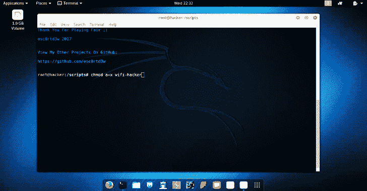](https://1.bp.blogspot.com/-PVO8gYD9n4s/XlgrwGSHw1I/AAAAAAAAFJ8/k39t5Vi0b2kYgnz2z4yXFR1Q9L0idDajACLcBGAsYHQ/s1600/WiFi%2BHacker.png)

**Wifi 黑客**是一个使用内置 kali 工具攻击无线连接的 shell 脚本。支持所有证券(WEP、WPS、WPA、WPA2)。

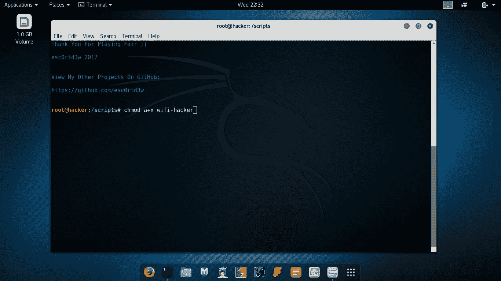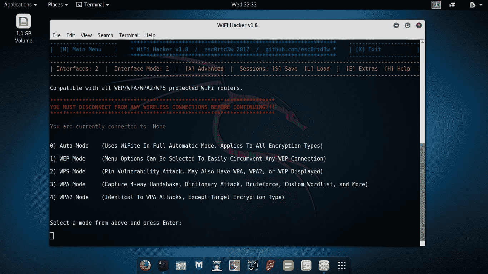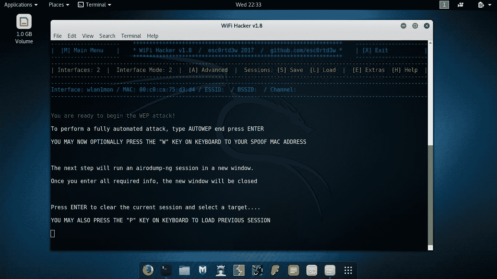

**又读-[ohmy Backup:扫描受害者备份目录&备份文件](https://kalilinuxtutorials.com/ohmybackup/)**

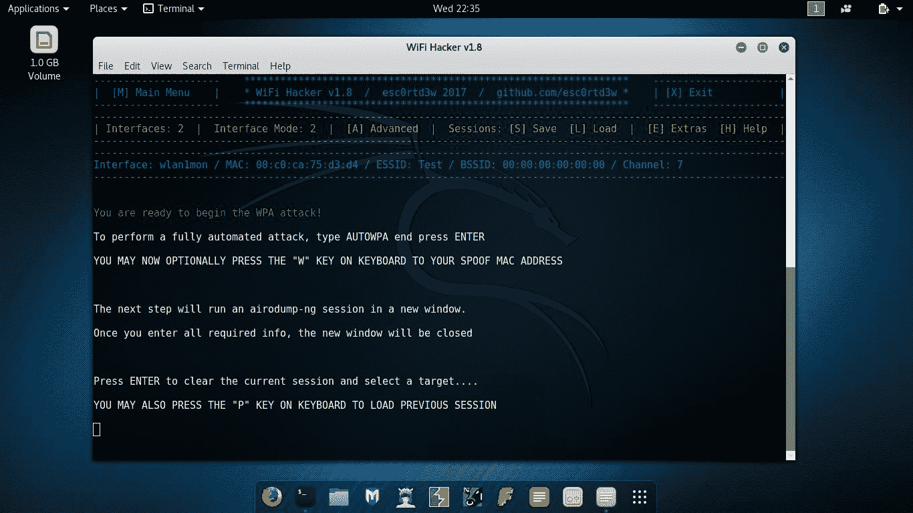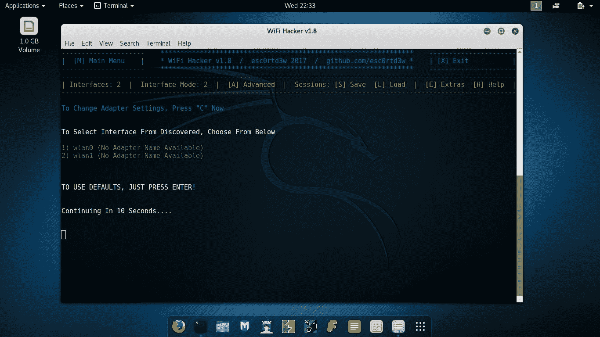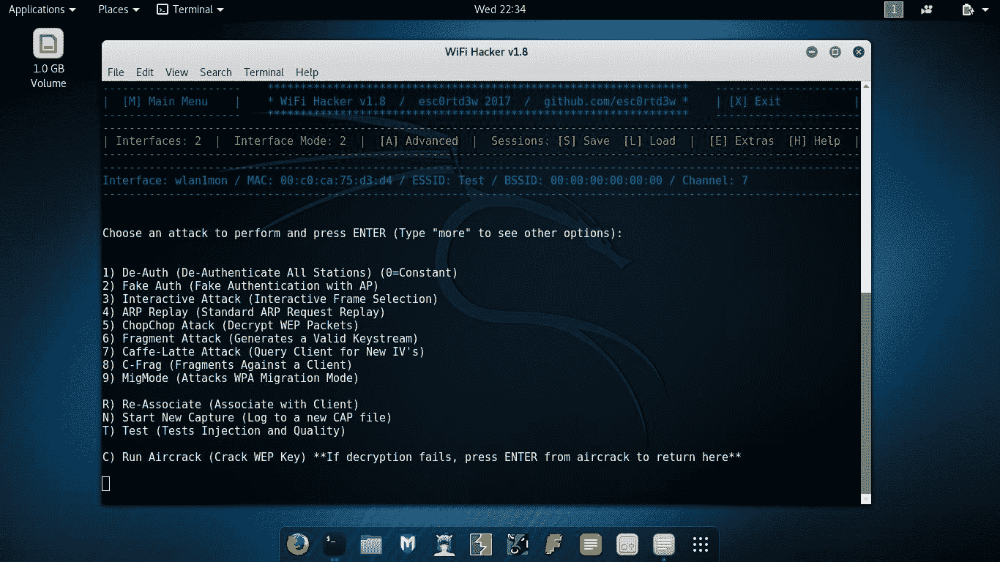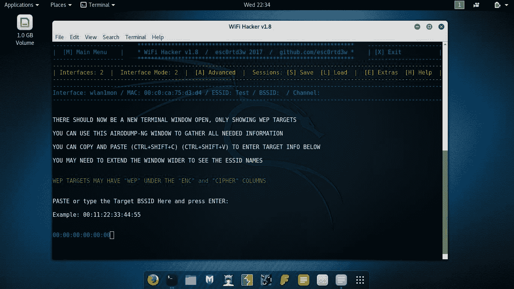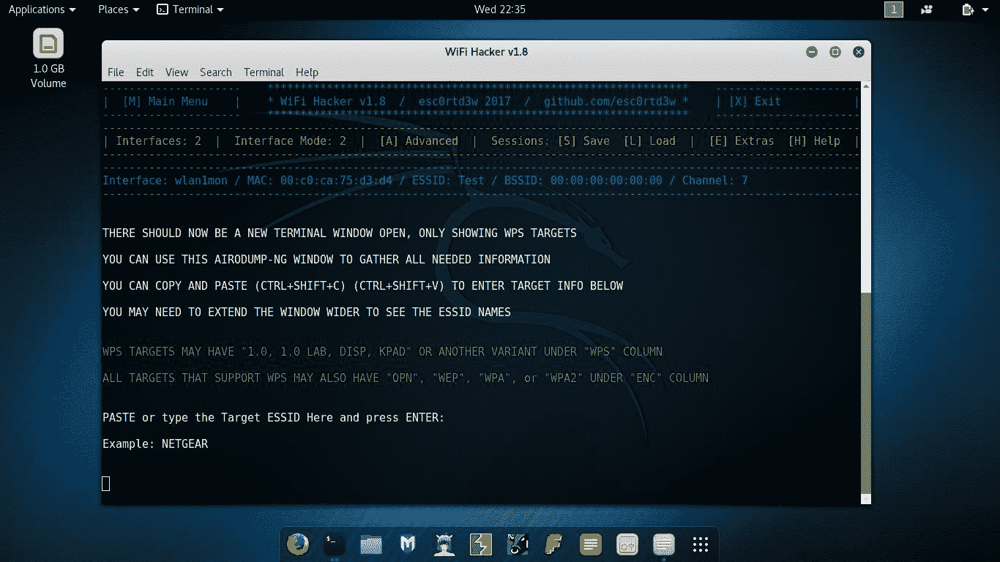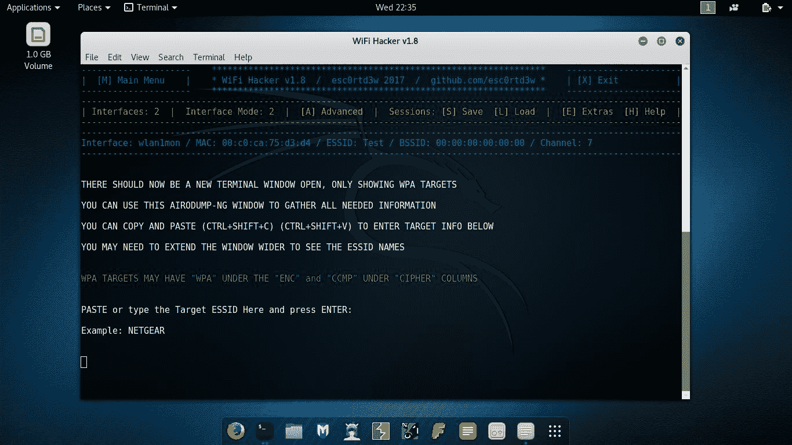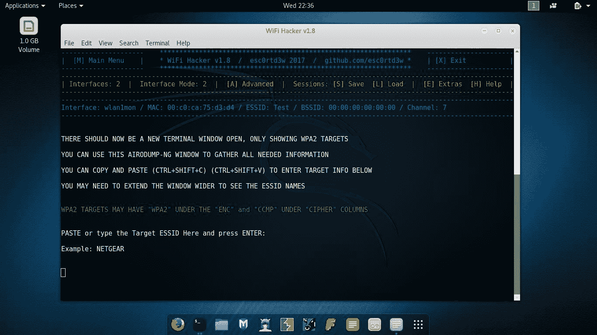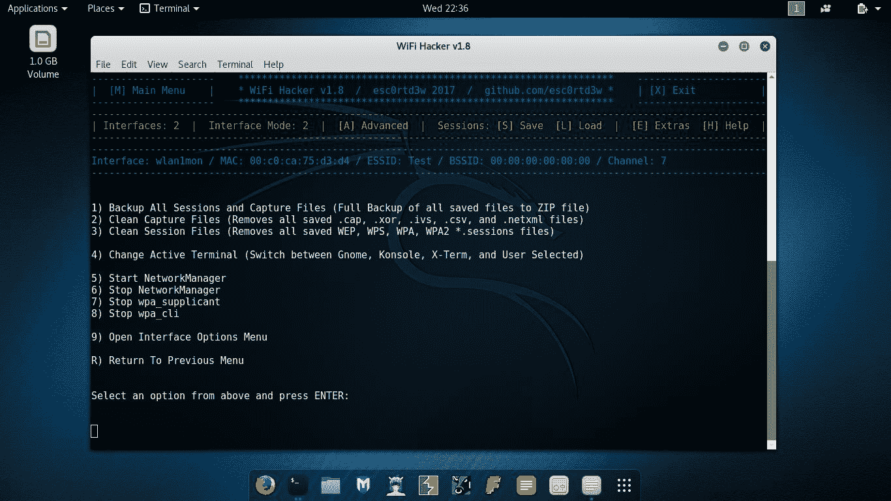[**Download**](https://github.com/esc0rtd3w/wifi-hacker)