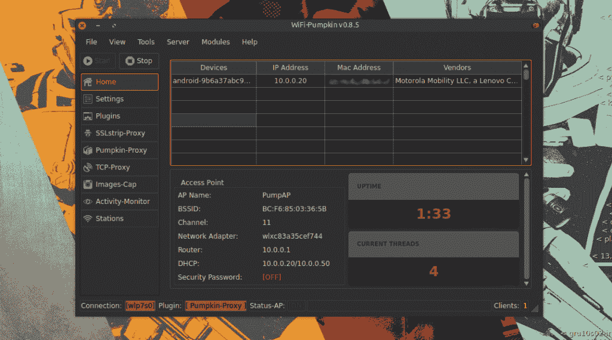

# WiFi-南瓜-流氓 Wi-Fi 接入点攻击的框架

> 原文：<https://kalilinuxtutorials.com/wifi-pumpkin-framework/>

WiFi-Pumpkin 是一个审计 Wi-Fi 安全的完整框架。主要特点是能够创建一个假的 AP 和使人在中间攻击，但功能列表是相当广泛的。

## **安装-WiFi-南瓜**

```
Python 2.7
git clone https://github.com/P0cL4bs/WiFi-Pumpkin.git
cd WiFi-Pumpkin
./installer.sh --install
```

## **特性**

*   流氓无线接入点。
*   拒绝攻击客户端 AP。
*   探测请求监视器。
*   DHCP 饥饿攻击。
*   凭据监视器。
*   透明代理。
*   Windows Update 攻击。
*   网络钓鱼管理器。
*   部分旁路 HSTS 协议。
*   支持牛肉勾。
*   ARP 中毒恶搞。
*   通过 MITM 修补二进制文件。
*   因果报应攻击(支持 hostapd-mana)。
*   LLMNR，NBT-NS 和 MDNS 投毒者(响应者)。
*   pumpkin-Proxy(Proxy server(mitm Proxy API))。
*   动态捕捉图像。
*   TCP 代理(带 scapy)



## **工具插件**

| 插件 | 描述 |
| :-- | :-- |
| [Dns2proxy](https://github.com/LeonardoNve/dns2proxy) | 一旦您将 DNS 服务器更改为受害者，此工具将提供不同的后解释功能。 |
| [Sstrip2](https://github.com/LeonardoNve/sslstrip2) | Sslstrip 是一个 MITM 工具，实现了莫邪马林斯派克的基于版本 fork @LeonardoNve/@xtr4nge 的 SSL 剥离攻击。 |
| [塞尔吉奥 _ 代理](https://github.com/supernothing/sergio-proxy) | Sergio Proxy(一个收集输入和输出的超级有效的记录器)是一个 HTTP 代理，它是用 Python 为 Twisted 框架编写的。 |
| [BDF proxy](https://github.com/davinerd/BDFProxy-ng) | 通过 MITM 修补二进制文件:BackdoorFactory + mitmProxy，bdfproxy-ng 是对原 BDFProxy @secretsquirrel 的一个分叉和回顾。 |
| [响应者](https://github.com/lgandx/Responder) | 一个 LLMNR，NBT 和 MDNS 投毒者。作者:洛朗·加菲 |

## **透明代理**

透明代理(mitmproxy ),可用于拦截和操纵 HTTP 流量修改请求和响应，允许将 javascript 注入到被访问的目标中。你可以很容易地实现一个模块，将数据注入到页面中，在目录“插件/扩展/”中创建一个 python 文件，它会自动列在南瓜代理标签上。

**也读作 [蕨无线安全的 Wifi 破解者](http://kalilinuxtutorials.com/fern-wifi-cracker/)**


## **TCP 代理服务器**

可以放在 TCP 流中的代理。它使用(scapy 模块)过滤请求和响应流，并主动修改被 WiFi-Pumpkin 截获的 TCP 协议数据包。这个插件使用模块来查看或修改拦截的数据，这可能是最容易实现的一个模块，只需在“插件/分析器/”上添加您的自定义模块，就会自动在 TCP-Proxy 选项卡上列出。

工具学分:[p0cl 4 bs](https://github.com/P0cL4bs)

 [](https://github.com/P0cL4bs/WiFi-Pumpkin)