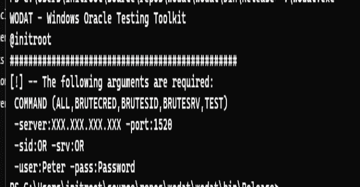
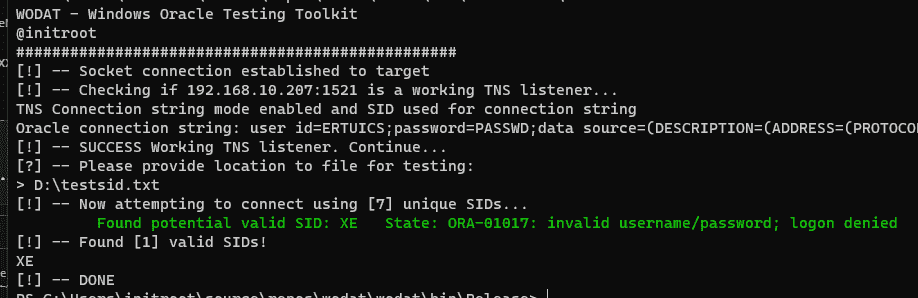
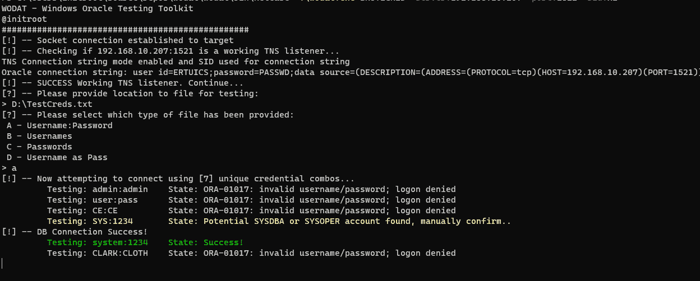
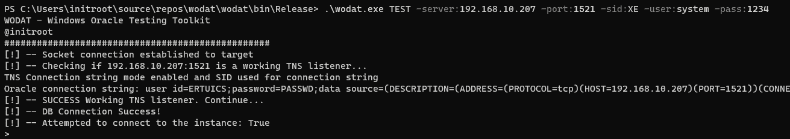
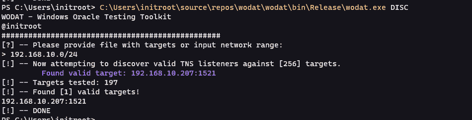

# Wodat : Windows Oracle 数据库攻击工具包

> 原文：<https://kalilinuxtutorials.com/wodat/>

[](https://blogger.googleusercontent.com/img/b/R29vZ2xl/AVvXsEhxmeKeO-N-_g1ngv1qefHaWRzFJxH4SaRMdaxFwF9rx85dEOuIzfUOZWPwD3BTitdtYsiOi8-PTpgaChsqnUjfv5ovx0J5EFfsJ6MsgwyPWNLy2R1fxcGJ8aojl6a74fJKZlKCDtlQbbVkagFbXUBEksNPpu6OuZEWCWYnt0_j8uE5vgp320vKiAFH/s728/wodat.png)

**Wodat** 是流行的 Oracle 数据库攻击工具()到 C#的简单移植。Net 框架。https://github.com/quentinhardy/odat 归功于[，因为很多功能都是从他的代码中移植过来的。](https://github.com/quentinhardy/odat)

*   执行基于密码的攻击，例如将用户名作为密码、根据给定密码列出用户名列表、根据给定用户名列出密码列表、用户名:pass combolist。
*   测试凭据/连接字符串是否对目标有效
*   发现有效 SID/服务名的暴力攻击
*   根据提供的目标文件或 CIDR 范围发现有效的 TNS 侦听器
*   我希望会有更多！

## 放弃

我对你使用该软件不负任何责任。开发是以我个人的身份完成的，与我的工作无关。

## 用法

所需的常规命令行参数如下:

```
wodat.exe COMMAND ARGGUMENTS
 COMMAND (ALL,BRUTECRED,BRUTESID,BRUTESRV,TEST,DISC)
 -server:XXX.XXX.XXX.XXX -port:1520
 -sid:AS OR -srv:AS
 -user:Peter -pass:Password
```

测试特定凭据集是否有效。

```
wodat.exe TEST -server:XXX.XXX.XXX.XXX -port:1521 -sid:XE -user:peter -pass:pan
```

更多用法请参见模块概述。该工具总是首先检查作为目标的 TNS 监听器是否工作。

## 模块

#### 布鲁特斯

模块执行单词表 SID 猜测攻击，如果不成功，将要求暴力攻击。

```
wodat.exe BRUTESID -server:XXX.XXX.XXX.XXX -port:1521
```



#### 布鲁特斯拉夫

模块执行单词列表服务名称猜测攻击，如果不成功，将要求暴力攻击。

```
wodat.exe BRUTESRV -server:XXX.XXX.XXX.XXX -port:1521
```

#### 粗野的

模块执行基于单词列表密码的攻击。存在以下选项:

```
A - username:password combolist with no credentials given during arguments
B - username list with password given in arguments
C - password list with username given in arguments
D - username as password with username list provided
```

使用具有用户名:密码组合的给定文件执行基本攻击。

```
wodat.exe BRUTECRED -server:XXX.XXX.XXX.XXX -port:1521 -sid:XE
```



#### 试验

模块测试给定的连接字符串是否可以成功连接。

```
wodat.exe TEST -server:XXX.XXX.XXX.XXX -port:1521 -sid:XE -user:peter -pass:pan
```



#### 唱片

模块将根据提供的 CIDR 范围或具有实例的文件执行发现。注意，只有具有有效 TNS 侦听器的实例才会被返回。测试网络范围会快得多，因为它是并行处理的。

```
wodat.exe DISC
```

要测试的实例必须按照下面的示例`targets.txt`进行格式化:

```
192.168.10.1
192.168.10.5,1521
```



### 全部

尚未实施。

#### 侦察

尚未实施。

## 设置和要求

您可以从 GitHub 操作中获取自动发布版本，或者使用以下命令自行构建:

```
nuget restore wodat.sln
msbuild wodat.sln -t:rebuild -property:Configuration=Release
```

一些一般注意事项:`Oracle.ManagedDataAccess.dll`库必须和二进制文件一起复制。我正在寻找嵌入它的方法。

## 全部

*   处理 SYSDBA 和 SYSOPER 连接
*   实施优秀模块
*   各种验证、错误处理代码仍然需要完成
*   一些已知的小错误修正
*   添加选项来检查 SID、服务名或通用凭据的内置列表

## 变更日志

版本 0.1–基本工具包和功能版本 0.2–几个错误修复、改进的套接字连接和增加的 RECON 模块

[Click Here To Download](https://github.com/InitRoot/wodat)