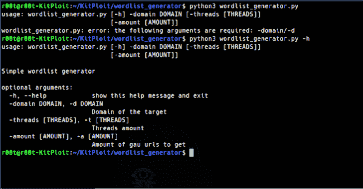

# 单词列表生成器:唯一单词列表的唯一单词列表生成器

> 原文：<https://kalilinuxtutorials.com/wordlist-generator/>

**单词表生成器**使用 tomnomnom 的报告[“谁，什么，哪里，什么时候”](https://www.youtube.com/watch?v=W4_QCSIujQ4)中提到的技术生成具有独特单词的单词表。它从 [gau](https://github.com/lc/gau) 获取网址，并将其拆分成网址中的单词。

然后，它请求每个 URL 获取所有单词。最后，wordlist_generator 从 wordlist 中删除“denylists”目录文件中的所有内容，只保留唯一的单词，这些单词可以用于域、目录、参数、vhosts 等强制。

**用途**

*   **例子:**

**$。/word list _ generator . py-d hackerone.com-a 5000-T50
$。/word list _ generator . py-d bugcrowd.com-a 1000
$。/word list _ generator . py-d intigriti.com>intigriti _ word list . txt**

要显示该工具的帮助，请使用-h 标志:

**。/wordlist_generator.py -h**

| 旗 | 描述 | 例子 |
| --- | --- | --- |
| `-domain` | 目标域 | `./wordlist_generator.py -d openbugbounty.org` |
| `-threads` | 线程数量 | `./wordlist_generator.py -d yahoo.com -t 6` |
| `-amount` | 要从 gau 获取的 URL 数量 | `/wordlist_generator.py -d twitter.com -a 10000` |

**安装**

**$ git 克隆 https://github.com/SomeKirill/wordlist_generator/
$ CD 单词列表 _ 生成器
$ pip 安装请求**

**Denylists 使用的单词表**

*   [https://github . com/danielmiessler/sec lists/blob/master/Discovery/we B- Content/raft-large-directory-lower case . txt](https://github.com/danielmiessler/SecLists/blob/master/Discovery/Web-Content/raft-large-directories-lowercase.txt)
*   [https://github . com/oprogramador/most-common-words-by-language/blob/master/src/resources/Dutch . txt](https://github.com/oprogramador/most-common-words-by-language/blob/master/src/resources/dutch.txt)
*   [https://github . com/first 20 hours/Google-10000-English/blob/master/Google-10000-English . txt](https://github.com/first20hours/google-10000-english/blob/master/google-10000-english.txt)
*   [https://tools.ietf.org/html/rfc1866](https://tools.ietf.org/html/rfc1866)

[**Download**](https://github.com/SomeKirill/wordlist_generator)