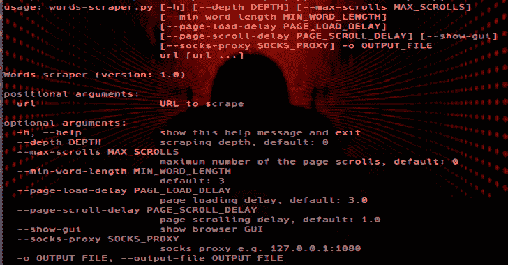

# 单词抓取器:基于 Selenium 的网络抓取器，用于生成密码列表

> 原文：<https://kalilinuxtutorials.com/words-scraper/>

Selenium based **web scraper** 生成密码列表。

**安装**

**$从 https://github.com/mozilla/geckodriver/releases 下载 Firefox webdriver
$ tar xzf geckodriver-v { VERSION-HERE } . tar . gz
$ sudo mv geckodriver/usr/local/bin #确保它在您的路径中
$ geckodriver–VERSION #确保 web driver 安装正确
$ git 克隆 https://github.com/dariusztytko/words-scraper
$ sudo pip 3 install-r words-scraper/requirements . txt**

**用例**

从目标页面中抓取单词

**$ python 3 words-scraper . py-o words . txt https://www.example.com https://blog.example.com**

这种生成的单词列表可用于执行在线暴力攻击或破解密码哈希:

**$ hashcat-m 0 hashes . txt words . txt**

使用–depth 选项也可以从链接的页面中抓取单词。可选–show-GUI 开关可用于跟踪进度并快速查看页面:

**$ python 3 words-scraper . py-o words . txt–depth 1–show-GUI https://www.example.com**

可以使用 words-converter.py 脚本扩展生成的单词列表。这个脚本删除了特殊字符和重音符号。一个波兰单词źdźbło 的例子！会转化成下面的话:

*   一根棍子！
*   zdzblo！
*   一根棍子
*   zdzblo

**$ cat words . txt | python 3 words-converter . py | sort-u>words 2 . txt**

*   **从目标的 Twitter 上抓取单词**

Twitter 页面在滚动时动态加载。使用–max-scrolls 选项删除单词:

**$ python 3 words-scraper . py-o words . txt–max-scrolls 300–show-GUI https://twitter.com/example.com**

*   **通过 Socks 代理抓取**

**$ ssh-D 1080-Nf { USER-HERE } @ { IP-HERE }>/dev/null 2>&
$ python 3 words-scraper . py-o words . txt–socks-proxy 127 . 0 . 0 . 1:1080 https://www.example.com**

**用途**

**用法:**Words-scraper . py[-h][–DEPTH DEPTH][–MAX-SCROLLS MAX _ SCROLLS]
[–MIN-WORD-LENGTH MIN _ WORD _ LENGTH]
[–PAGE-LOAD-DELAY PAGE _ LOAD _ DELAY]
[–PAGE-SCROLL-DELAY PAGE _ SCROLL _ DELAY][–show-GUI]
[–SOCKS-PROXY SOCKS _ PROXY]-o OUTPUT _ FILE
URL【URL……】
Words scraper(版本:1.0)
默认:0
–MIN-WORD-LENGTH MIN _ WORD _ LENGTH
默认:3
–PAGE-LOAD-DELAY PAGE _ LOAD _ DELAY
页面加载延迟，默认:3.0
–PAGE-SCROLL-DELAY PAGE _ SCROLL _ DELAY
页面滚动延迟，默认:1.0
–show-GUI 显示浏览器 GUI
–SOCKS-PROXY SOCKS _ PROXY
SOCKS 代理例如:127.0.0.1:1080

[**Download**](https://github.com/dariusztytko/words-scraper)