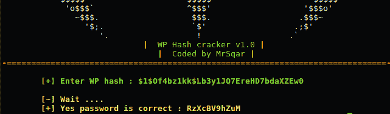
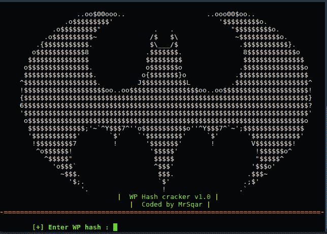

# 强力 WordPress 的简单工具

> 原文：<https://kalilinuxtutorials.com/wpcrack/>

Wpcrack 是暴力 WordPress 的简单工具。它是由 ZoneSec 团队使用 python 语言开发的。

## **安装 WP crack**

**`git clone https://github.com/MrSqar-Ye/wpCrack.git`**

**也可理解为 [CSS 键盘记录器——Chrome 扩展和 Express 服务器，利用 CSS](https://kalilinuxtutorials.com/css-keylogger-chrome-exploits-keylogging/)** 的键盘记录能力

#### **WordPress hash cracker**

#### **视频**
