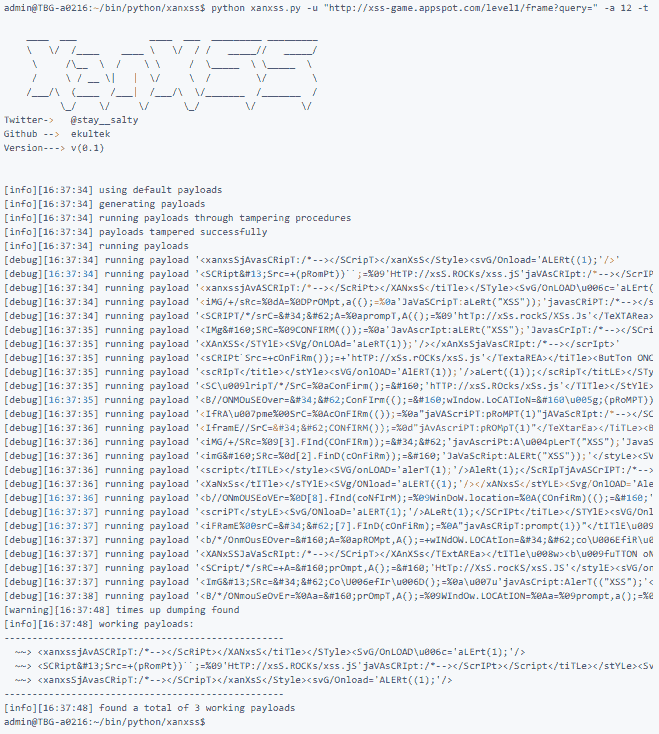
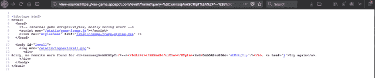
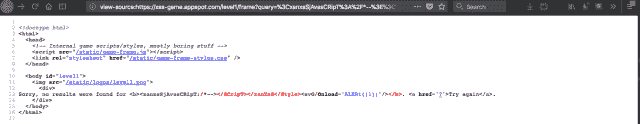

# XanXSS:一个简单的 XSS 查找工具

> 原文：<https://kalilinuxtutorials.com/xanxss-xss-finding-tool/>

XanXSS 是一个反射的 XSS 搜索工具(DOM 即将推出),它基于模板创建有效负载。不像其他 XSS 扫描仪只运行一个有效载荷列表。XanXSS 试图使有效负载无法识别，例如:

```
<xAnXSS</TitLE></STYLE><SVG/ONload = ' alERt(1)；'/></XaNxSs</titLe></StYlE><SvG/ONlOAD = ' alerT(1)；'/ > < ifrAmE Src= [2]。查找(确认)；= " JAVaScRIpT:proMpT(1))" JAVaScRIpT:/*–></scRIPt>/>点击我！</b</TextaRea></TiTLE><按钮 ONcLIck = ' aleRT(1)；'/>xan XSS</TEXTaRea>
```

使用 XanXSS，每个有效载荷都是不同的。XanXSS 的工作方式是遍历有效负载，直到找到指定的数量或定时器达到最大时间，这可以防止它循环太长时间。XanXSS 中包含的一些功能:

*   使用`-H`传递你自己的标题的能力
*   使用`-P`生成多语言脚本的能力
*   使用`--proxy`在代理后面运行的能力
*   还有更多

**也可阅读-[ISeeYou:在社交工程或网络钓鱼活动中获取用户准确位置的工具](https://kalilinuxtutorials.com/iseeyou-exact-location/)**

**概念验证**

为了证明这个概念，我们将使用[https://xss-game.appspot.com/level1/frame](https://xss-game.appspot.com/level1/frame)



现在让我们检查网站 HTML 中的那些脚本:

*   
*   
*   

**选项**

XanXSS 完全具备使用代理的能力，与 proxychains 兼容，并允许您添加自定义头。为了您的方便，我提供了一个完整的选项列表:

用法:xanxss . py[-H][-u http://test.com/test.php?id=][-a VERIFY]
[-F AMOUNT][-t TIME][-P SCRIPT，[SCRIPT，…]]
[-F FILE-PATH][-v][–proxy TYPE://IP:PORT]
[-H HEADER = VALUE，HEADER:VALUE][–throttle TIME secs][-P]

可选参数:
-h，–help 显示此帮助消息并退出
-u http://test.com/test.php?id=,–URL http://test.com/test.php?id=

建议您使用带有查询参数
的 URL-a VERIFY，–amount VERIFY
需要多少验证步骤，这将
决定有效负载的可靠性。
验证步骤越多，有效负载就越可靠
(默认值=5)
-f AMOUNT，–find AMOUNT 尝试查找此数量的工作有效负载，指定此值并不能保证您会找到此数量的工作有效负载(默认值=25)
-t TIME，–TIME TIME 测试所花费的时间(秒)，此
将用作验证的计时器
(默认值=35s)
-p 脚本，[脚本，…]，–有效负载脚本，[脚本 …]传递您自己的有效负载的逗号分隔列表，必须包含至少 5 个有效负载
-F FILE-PATH，–FILE FILE-PATH 传递包含有效负载的文本文件，每行一个，必须包含至少 5 个有效负载
-v，–verbose 以详细模式运行并显示更多输出(默认值= False)
–代理类型://IP:PORT
以 TYPE://IP:PORT
-H HEADER = VALUE，HEADER:VALUE， –headers HEADER = VALUE，HEADER:VALUE
将您自己的自定义头添加到请求中
(默认为连接，用户代理)
–throttle TIME(秒)用休眠时间(默认为 0)
-P，–polyglot 生成一个 polyglot 脚本，附加到
运行脚本的末尾，如果有 XSS，应该会找到它
(*默认为 False)

[**Download**](https://github.com/Ekultek/XanXSS)