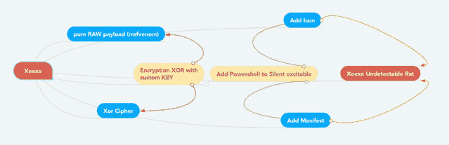
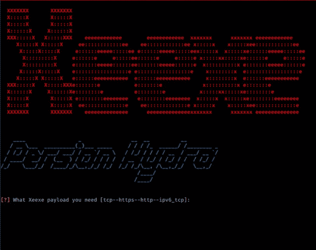

# Xeexe:不可检测&用自定义密钥进行异或加密

> 原文：<https://kalilinuxtutorials.com/xeexe/>

**Xeexe** 是一个不可检测的反向外壳&用自定义密钥(FUD Metasploit Rat)进行 Xor 加密绕过顶级杀毒如 BitDefender，Malwarebytes，Avast，ESET-NOD32，AVG，…(PYTHON 3)。

**不可检测的反向外壳(Metasploit Rat)**

这是一个 FUD 利用工具，它可以编译带有著名有效负载的恶意软件，然后编译的恶意软件可以在 Windows 上执行。该工具提供了一种简单的方法来创建可以绕过顶级防病毒软件的后门和有效负载。

**特性**

*   python3 和 Ngrok 支持。
*   自动异或加密与客户密钥，您可以使用增加旁路反病毒。
*   自动添加图标到可执行文件。
*   自动将清单添加到可执行文件。
*   用纯 raw 和 xor 绕过反病毒后门。
*   支持操作系统 windows 7 到 windows 10。
*   完全自动化的 MSFvenom & Metasploit。
*   custum 图标(将您的图标复制到图标文件夹，并将其重命名为 icon.ico)
*   将 PowerShell 添加到静默可执行文件。
*   绕过顶级杀毒如 BitDefender，Malwarebytes，Avast，ESET-NOD32，AVG，…

**也可阅读-[Tangalanga:缩放会议扫描仪黑客工具](https://kalilinuxtutorials.com/tangalanga/)**

**待办事项**

*   从右向左添加 unicode (Rtlo 攻击)-示例:Xegpj.exe = > Xeexe.jpg
*   向 xieexie 二进制文件中添加随机符号以实现持久性 fud

**安装&如何使用**

如何安装 *Xeexe* 的说明

$ **git 克隆 https://github . com/persianhydra/xeexe-topant virus evasion . git
$ CD xeexe-topant virus evasion
$ chmod+x install . sh&&。/install . sh
$ chmod+x xeexe . py&&python 3 xeexe . py**

**要求**

*   Metasploit 框架
*   msfvenom
*   葡萄酒
*   Mingw-w64 编译器

**截图**

**更新日志**

版本 1.0.1 =首次运行时修复错误

**Youtube 视频**

[点击此处](https://github.com/persianhydra/Xeexe-TopAntivirusEvasion/blob/master)观看视频。

**免责声明**

此工具仅用于教育目的，未经双方同意使用 Xeexe 攻击目标是非法的。开发人员不承担任何责任，也不对本程序造成的任何误用或损坏负责。

[**Download**](https://github.com/persianhydra/Xeexe-TopAntivirusEvasion)