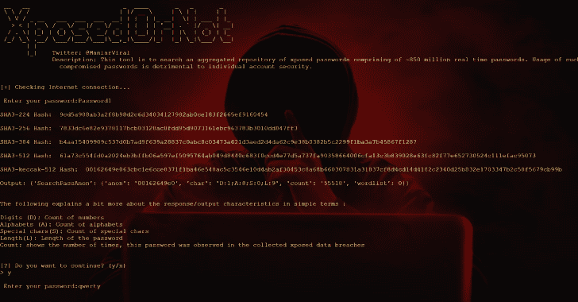

# XoN:搜索暴露密码聚合库的工具

> 原文：<https://kalilinuxtutorials.com/xon-aggregated-repository-xposed-passwords/>

**XposedOrNot 或 XoN** 工具用于搜索由约 8 . 5 亿个实时密码组成的已暴露密码聚合库。使用这种泄露的密码对个人帐户安全是有害的。

这个项目的主要目的是给公众一个免费的平台来检查他们的密码是否暴露和泄露。

这个大规模的密码收集是世界各地各种数据泄露中暴露的真实密码的积累。密码来自暴露的漏洞，如 Collection #1、Yahoo 等。

除此之外，在 pastebin.com，密码也经常暴露在“浆糊”中。我们已经拍摄了超过 40，000 张这样的照片，这又被添加到这个庞大的列表中。

整理后的密码使用高度安全的哈希算法 SHA-3 ( Keccak-512)进行哈希处理，并存储在单向哈希中以供验证。没有密码存储在纯文本中，匿名检查的过程在我们的博客文章《8.5 亿个免费密码》中有详细解释，该文章解释了为增强安全态势而实施的技术和操作控制。你可以自由地经历同样的事情。

**安装**

**git 克隆 https://github.com/Viralmaniar/XposedOrNot.git
CD XposedOrNot
pip install-r requirements . txt
python XposedOrNot . py**

如何解释一个输出？

为了便于参考，输出将由 JSON 输出组成。在 JSON 中给出输出而不是是/否的主要原因是为了确保人们可以进一步使用它来开发和改进这里汇总的大量实时暴露密码。

好的，第一个元素“anon”被添加到存储在 XoN 中的所有密码散列中，以便有隐私意识的用户也能进行搜索。第二个元素“char”是密码特征的列表，其可以进一步用于理解密码的强度，以知道这是否满足需要的应用的要求。

许多网站都有根据字符数、字母组合、数字和特殊字符选择密码的政策。

下表用简单的术语解释了更多的特征:

| 字母表 | 描述 |
| --- | --- |
| 数字 | 数字计数 |
| 字母表 | 字母数 |
| 特种车 | 特殊字符计数 |
| 长度 | 密码的长度 |

最后一个“计数”表示在收集的暴露数据违规中观察到该密码的次数。有关所有已曝光网站的完整列表，请访问已曝光网站-XoN。

另外，需要注意的另一点是使用 Keccak-512 散列在 XoN 中搜索和存储数据。像 MD5 和 SHA1 这样的传统哈希算法目前已经被弃用，而且考虑到暴露的大量记录，我已经开始使用 Keccak-512 哈希。

是的，Keccak-512 是 128 个字符长，它消耗更多的存储空间。

为了便于参考，给出了两个 Keccak-512 哈希示例:**测试–1e 2e 9 fc 2002 b 002d 75198 b 7503210 c 05 a 1 baac 4560916 a 3c 6d 93 bcce 3a 50 D7 f 00 FD 395 BF 1647 b 9 abb 8d 1 afcc 9 c 76 c 289 b 0 c 9383 ba 386 a 956 da 4b 389344177789 e 通过–ADF 34 F3 e 63 A8 e。**

**{
“错误”:“未找到”
}**

[**Download**](https://github.com/Viralmaniar/XposedOrNot)