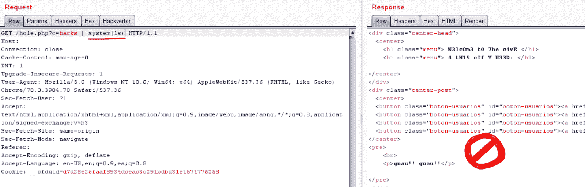
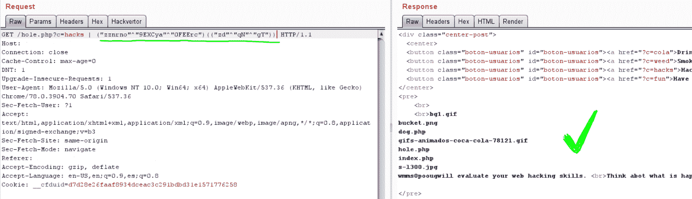
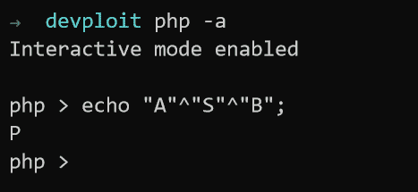

# XORpass:使用 XOR 运算绕过晶片过滤器编码器

> 原文：<https://kalilinuxtutorials.com/xorpass-encoder-bypass-waf-xor/>

**XORpass** 是一个使用 XOR 运算绕过晶圆过滤器的编码器。

**安装&使用**

**git 克隆 https://github.com/devploit/XORpass
CD xor pass
$ PHP encode.php 字符串
$ PHP decode.php“异或字符串”**

**旁路示例**

**使用清除 PHP 函数:**

**也可阅读-[JSONBee:一个准备好使用 JSONP 端点/有效负载来帮助绕过不同网站的内容安全策略](https://kalilinuxtutorials.com/jsonbee-jsonp-endpoints-payloads/)**

**使用 XOR 旁路的那个函数:**

**$ PHP encode.php 系统# return A
$ PHP encode.php ls # return B
payload = = A(B)**

为什么 PHP 把我们的有效载荷当作一个字符串？

^是异或运算符，这意味着我们实际上是在处理二进制值。所以让我们来分析一下发生了什么。

二进制值的 XOR 运算符将返回 1，其中只有一位为 1，否则返回 0 (0^0 = 0，0^1 = 1，1^0 = 1，1^1 = 0)。当您对字符使用 XOR 时，您使用的是它们的 ASCII 值。这些 ASCII 值是整数，所以我们需要将它们转换成二进制，以了解实际情况。

**a = 65 = 1000001
s = 83 = 1010011
b = 66 = 1000010
a 1000001
^
s 1010011
^
b 1000010
————————
结果 0010010 = 80 = P** 

如果我们模仿 A"^"S"^"B";'正如我们看到的，PHP 将返回一个 P。

[**Download**](https://github.com/devploit/XORpass#example-of-bypass)