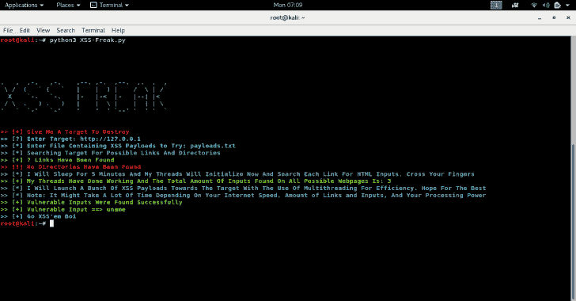

# XSS 怪胎:XSS 扫描仪完全由 Python3 从头开始编写

> 原文：<https://kalilinuxtutorials.com/xss-freak/>

**XSS 怪胎**是一个完全用 python3 从头开始写的 XSS 扫描器。它是同类中的一种，因为它抓取网站上所有可能的链接和目录，以扩大其攻击范围。

然后它搜索输入标签，然后启动一堆 xss 有效载荷。如果一个输入没有经过净化，容易受到 xss 攻击，该工具将在几秒钟内发现它。

**要求**

*   互联网连接速度快。
*   能够同时处理大量线程的新电脑。
*   当然是运气。

**它是如何工作的**？

首先，您提供一个目标网站进行扫描，并提供一个包含不同 XSS 有效负载的列表(更好的低数量和更有效和最少检测到的有效负载)，然后它在主网站(索引页面)上搜索可能的链接和目录，然后在找到的目录(如果存在)上搜索在初始搜索中没有找到的其他链接，并将它们添加到攻击范围。

然后，该工具将抓取在初始扫描和 HTML 输入目录中的链接中找到的所有链接。然后，该工具将所有找到的 HTML 输入添加到其攻击范围。

然后，该工具使用列表中用户提供的 XSS 有效负载对所有 HTML 输入发起攻击。如果 HTML 输入没有被正确地清理和过滤，脚本会立即检测到它，并打印出易受攻击的参数。

**注:**脚本对老电脑来说太强大了。

**优势**

*   支持多线程以提高效率和更快的处理速度。
*   同类中的一种。
*   能够抓取所有的网站，而不仅仅是特定的网页。
*   百搭。

**缺点**

*   由于对硬件的高需求，在手机上不受支持。
*   需要高速互联网连接才能正常工作，否则会出错或花费太多时间。
*   需要中等至最好的硬件，因为它处理和管理大量的线程和任何旧的硬件脚本将导致计算机滞后或崩溃，所以要小心。

[**Download**](https://github.com/hacker900123/XSS-Freak)