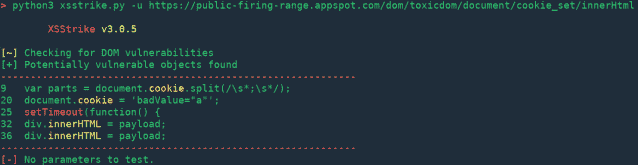
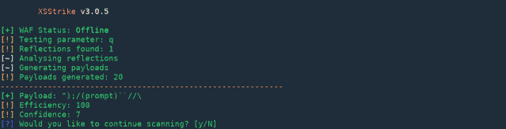
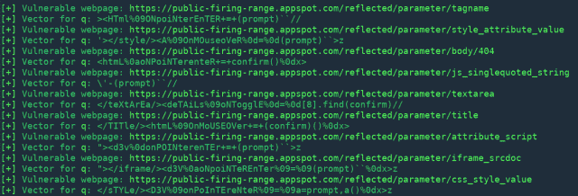
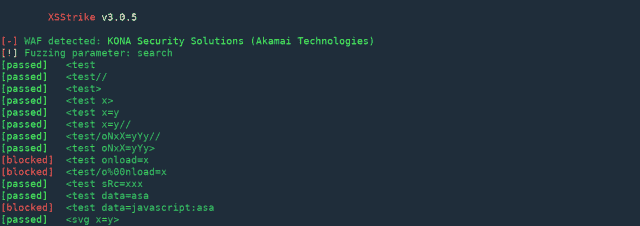
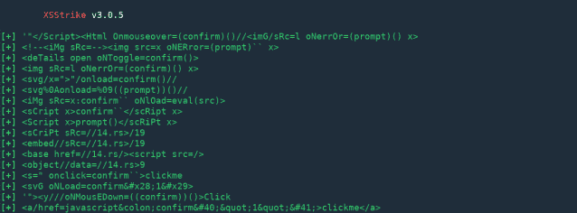
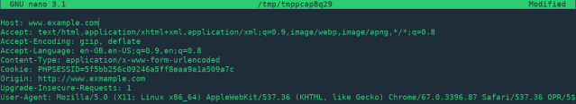
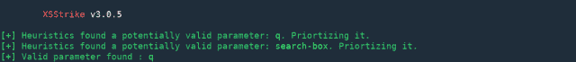

# XSStrike:最先进的 XSS 扫描仪

> 原文：<https://kalilinuxtutorials.com/xsstrike-xss-scanner/>

XSStrike 是一个跨站点脚本检测套件，配备了四个手写解析器、一个智能负载生成器、一个强大的模糊引擎和一个速度惊人的爬虫。

XSStrike 不像其他工具那样注入有效负载并检查其工作情况，而是使用多个解析器分析响应，然后通过与 fuzzing 引擎集成的上下文分析来制作有效负载。

以下是 XSStrike 生成的有效负载的一些示例:

```
}]};(confirm)()//\
<A%0aONMouseOvER%0d=%0d[8].find(confirm)>z
</tiTlE/><a%0donpOintErentER%0d=%0d(prompt)``>z
</SCRiPT/><DETAILs/+/onpoINTERenTEr%0a=%0aa=prompt,a()//
```

除此之外，XSStrike 还具有爬行、模糊、参数发现和晶片检测功能。它还扫描 DOM XSS 漏洞。

**又读-**[**Django defect Dojo:开源应用漏洞关联&安全编排工具**](https://kalilinuxtutorials.com/defectdojo/)

**特性**

*   反射和 DOM XSS 扫描
*   多线程爬行
*   语境分析
*   可配置内核
*   晶圆检测与规避
*   过时的 JS 库扫描
*   智能有效载荷发生器
*   手工制作的 HTML 和 JavaScript 解析器
*   强力起毛引擎
*   盲人 XSS 支持
*   高度研究的工作流程
*   完整的 HTTP 支持
*   从文件中强制有效负载
*   由光子，泽塔尼泽和阿琼提供动力
*   有效载荷编码

**画廊**

多姆 XSS



**映 XSS**



**爬行**



**起毛**



**从文件中强制有效载荷**



**交互式 HTTP 头提示**



**隐藏参数发现**

[Download](https://github.com/s0md3v/XSStrike)