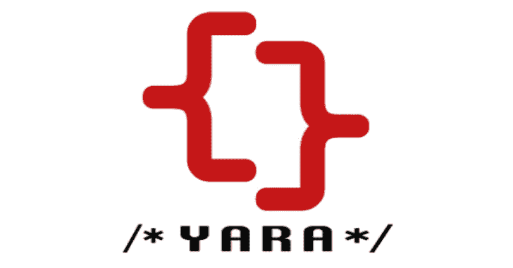

# Yarasafe:匹配 Yara 中函数的安全嵌入

> 原文：<https://kalilinuxtutorials.com/yarasafe/>

**YARASAFE** 用于 Yara 的自动二进制函数相似性检查。SAFE 是由 Massarelli L .、Di Luna G.A .、Petroni F .、Querzoni L .和 Baldoni R 开发的用于创建二进制函数嵌入的工具。您可以使用 SAFE 创建您的函数嵌入以在 yara 规则内使用。

如果您感兴趣，请看看我们的研究论文:https://arxiv.org/abs/1811.05296.如果您在研究中使用该论文，请引用:

**@ inproceedings { Massarelli 2018 SAFE，
title = { SAFE:Self-attention Function Embeddings for Binary Similarity }，
作者={Massarelli，Luca and Di Luna，Giuseppe Antonio and Petroni，Fabio and Querzoni，Leonardo and Baldoni，Roberto}，
book title = {第 16 届入侵和恶意软件检测会议论文集&漏洞评估(DIMVA)}，
年份={2019}
}**

这不是重现论文中实验的代码。如果你对它感兴趣，看看:https://github.com/gadiluna/SAFE

**简介**

使用 yarasafe，您可以轻松地为二进制函数创建签名，根本不用查看汇编代码！你只需要安装你在这个库的 IDA Pro 插件文件夹中找到的 IDA Pro 插件。

一旦你安装了插件，你就可以开始为你想要匹配的功能创建插件了。这些嵌入可以被插入到 yara 规则中，以使用 yara 来匹配函数。

要创建强大的规则，您可以将多个函数嵌入与标准 yara 规则相结合。在这个库中，你会找到 IDA Pro 的插件和 yarasafe 模块。

Yarasafe 可以匹配 50 条以上 150 条以下的函数。

**也可阅读-[Gophish:开源钓鱼工具包](https://kalilinuxtutorials.com/gophish-open-source-phishing-toolkit/)**

**要求**

*   python3
*   radare2
*   詹森，过来

**快速入门**

首先安装 IDA Pro 插件。你可以在这个库的 ida-pro-plugin 文件夹中找到操作说明。然后你可以使用我们的 docker 容器或者你可以用 yarasafe 模块构建 yara。

**码头工人**

使用 yarasafe 最快的方法是使用我们的 docker 容器。

*   提取图像:

**码头工拉马萨雷利/雅拉沙费**

*   启动 docker，装入包含要分析的规则和文件的文件夹:

**docker run-v { FOLDER _ TO _ MOUNT }:/home/yarasafe/test-it massarelli/yarasafe bash**

使用您的规则在 docker 中启动 yara！

**Ubuntu**

*   克隆存储库:

**git 克隆 https://github . com/lucamassarelli/yaasafe . git**

*   安装 yara 依赖项:

sudo apt-get install automake libtool make gcc flex bison
sudo apt-get install libjansson-dev

*   在您的系统上安装 radare2:

git 克隆 https://github.com/radare/radare2.git
CD 雷达 2
。/sys/install.sh

*   安装 yarasafe 依赖项:

**CD yara safe/python _ script
pip 3 install-r requirements . txt**

*   编译:

**。/bootstrap.sh
。/配置
使**

*   导出环境变量:

**export yaray script = { PATH _ TO _ yara safe _ REPO }/python _ script**

**苹果电脑**

*   克隆存储库:

**git 克隆 https://github . com/lucamassarelli/yaasafe . git**

*   安装 yara 依赖项:

brew install automake libtool flex bison
brew install jansson

*   在您的系统上安装 radare2:

git 克隆 https://github.com/radare/radare2.git
CD 雷达 2
。/sys/install.sh

*   安装 yarasafe 依赖项:

**CD yara safe/python _ script
pip 3 install-r requirements . txt**

*   编译:

**。/bootstrap.sh
。/configure.sh
制作**

*   导出环境变量:

**export yaray script = { PATH _ TO _ yara safe _ REPO }/python _ script**

**测试**

在文件夹 rules 中，您可以找到规则 sample_safe_rule.yar。该规则应该会触发任何 PE 文件:

**yara { PATH _ TO _ yara safe _ REPO }/rules/sample _ safe _ rule . yar { FILES }**

**如何编写你的规则**

要创建您的 safe-yara 规则，您首先需要为您的函数创建嵌入。为了实现这一点，您可以使用这个存储库中附带的 IDA Pro 插件。

在 ida-pro-plugin 文件夹中，你可以找到关于如何运行插件的所有信息！

一旦您获得了函数的嵌入，您只需要创建规则。safe-yara 规则的一个例子是:

**导入" safe"
规则示例
{
meta:
description = "这只是一个示例"
threat _ level = 3
in _ the _ wild = true
condition:
safe . similarity("[-0.02724416，0.00640265，0.01138294，-0.07013566，0.00306808，-0.09708**

如果样本中至少有一个函数与目标的相似度大于 0.95，则满足该规则。

**将 safe 添加到您的 yara 版本中**

如果您想将 safe 添加到您的 yara 存储库:

*   安装所有依赖项
*   将文件 libyara/modules/safe.c 复制到 your _ rep/libyara/modules/safe . c 中
*   将文件夹 libyara/include/python 复制到 your_rep/libyara/include 中
*   在 libyara/modules/module_list 的末尾添加“` MODULE(safe
*   修改 libyara/Makefile.am:

    *   **后一行:**
        Libya ra _ la _ LD flags =-version-number 3:8:1

    *   **添加:**
        Libya ra _ la _ LD flags+=-LPATH _ TO _ python 3。*_LIB -lpython3。*m -ljansson

*   编译！`

[**Download**](https://github.com/lucamassarelli/yarasafe)