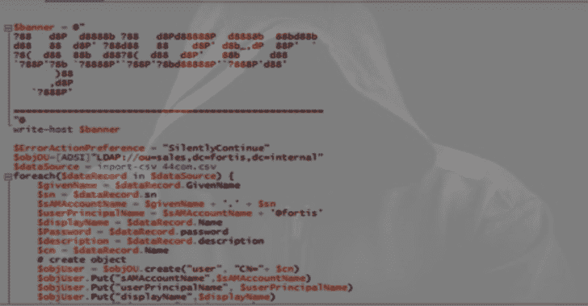

# Youzer:用于活动目录环境的假用户生成器

> 原文：<https://kalilinuxtutorials.com/youzer-fake-user-active-directory/>

用于活动目录环境的伪用户生成器。Youzer 的目标是创建信息丰富的活动目录环境。这使用 python3 库“faker”来生成随机账户。

**pip3 安装 faker**

您可以提供一个单词列表或生成密码。generated 选项非常适合测试 hashcat 规则掩码之类的东西。

当想要提供一个植入到环境中的特定密码列表或者练习字典攻击时，单词列表选项是有用的。

输出是一个 CSV 和一个 PowerShell 脚本，两者都可以复制到目标。执行时，PowerShell 脚本通过 LDAP 绑定，因此不依赖于较新的 Active Directory 模块，并创建每个用户对象。

目前，OU 需要存在，但该工具是“Labseed”的子项目，将在其中创建活动目录结构。

**也读作-[哈希标识符:软件识别用于加密数据的不同类型的哈希&尤其是密码](https://kalilinuxtutorials.com/hash-identifier-encrypt-data-especially-passwords/)**

**路线图**

*   生成多个部门(OU)
*   生成分组结构并随机分配
*   实现附加的 Faker 对象选项来填充其他 LDAP 字段，如地址、地区
*   创建嵌套分组结构的组织结构图

**例题**

Youzer 可以在 30 秒内创建 10 万个用户，在 3 分钟左右创建 100 万个用户。

**[-]域名设置为:example
[*]写入输出文件:sales_example.csv
[！]在密码生成模式下生成 100000 个用户
[！]创建 Powershell 脚本进行导入:sales _ example . PS1
python 3 youzer . py–generate–generate _ length 20–ou–domain example 20.35s 用户 0.11s 系统 95% cpu 21.354 合计**

**创建 1000 个用户账户，随机生成 20 个字符的字母数字密码选择**

**python 3 youzer . py–generate–generate _ length 20–ou " ou = sales，dc=example，DC = Domain”-Domain example–users 1000–output sales _ example . CSV

作者:@lorentzenman
团队:SpiderLabs

[-]域名设置为:example
[*]写入输出文件:sales_example.csv
[！]在密码生成模式下生成 1000 个用户
[！]创建用于导入的 Powershell 脚本:sales_example.ps1**

**演示**

[https://www.youtube.com/embed/DIdFxF814AA?feature=oembed&enablejsapi=1](https://www.youtube.com/embed/DIdFxF814AA?feature=oembed&enablejsapi=1)

[**Download**](https://github.com/SpiderLabs/youzer)