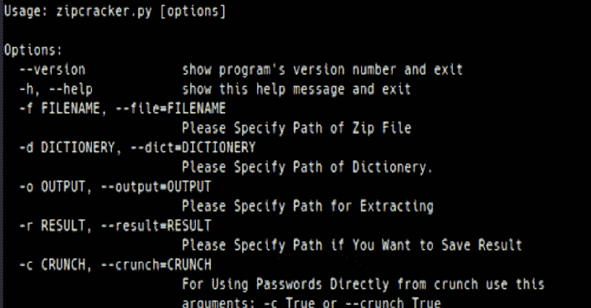

# Zip Cracker:用字典攻击破解 Zip 密码的 Python 脚本

> 原文：<https://kalilinuxtutorials.com/zip-cracker/>

**Zip Cracker** 是一个用字典攻击破解 Zip 密码的 python 脚本，也使用 crunch 作为管道。

*   这个脚本在这个版本中只支持 zip 文件
*   您也可以将这个脚本与 crunch 一起使用
*   支持跨平台

**用途**

**选项:**
–version 显示程序的版本号并退出
-h，–help 显示此帮助信息并退出
-f FILENAME，–File = FILENAME
请指定 Zip 文件的路径
-d dictionary，–dict = dictionary
请指定 dictionary 的路径。
-o 输出，–OUTPUT = OUTPUT
请指定提取结果的路径，–RESULT = RESULT
如果要保存结果，请指定路径
-c CRUNCH，–CRUNCH = CRUNCH
要直接从 CRUNCH 使用密码，请使用此
参数:-c True 或–CRUNCH True

*   **例 1**

**–python zip cracker . py-f test file . zip-d passwords . txt**

*   **例 2:**

**-python zip cracker . py-f test file . zip-d passwords . txt-o extract dir**

[**Download**](https://github.com/priyankvadaliya/Zip-Cracker-)