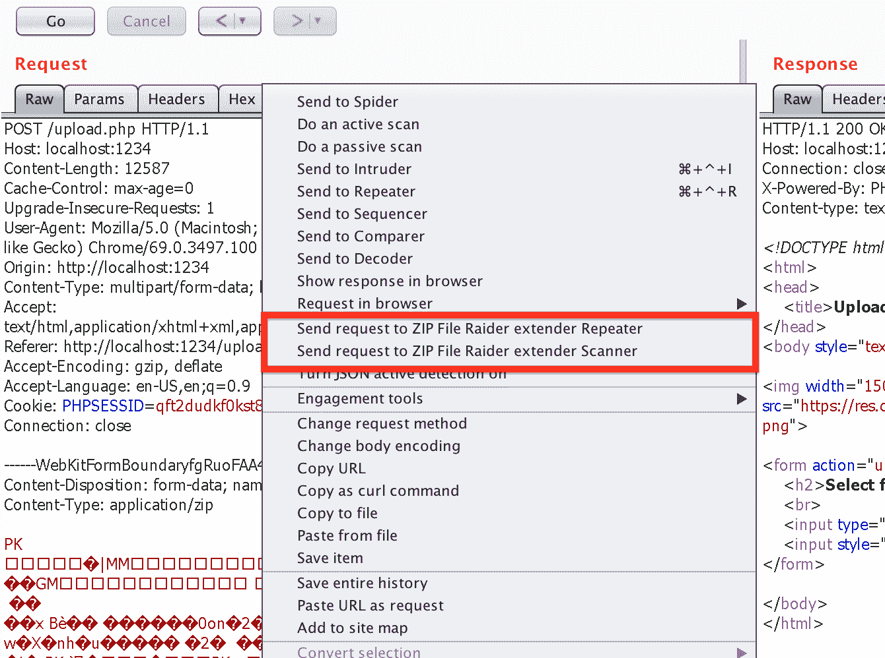
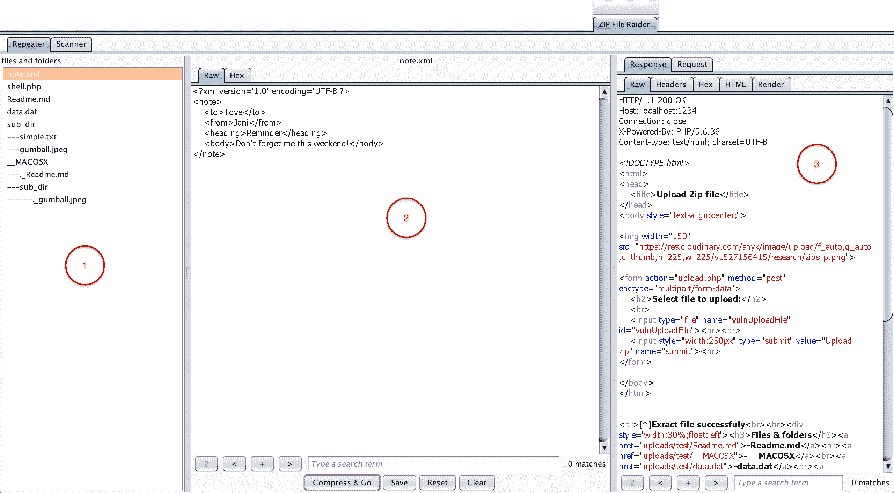
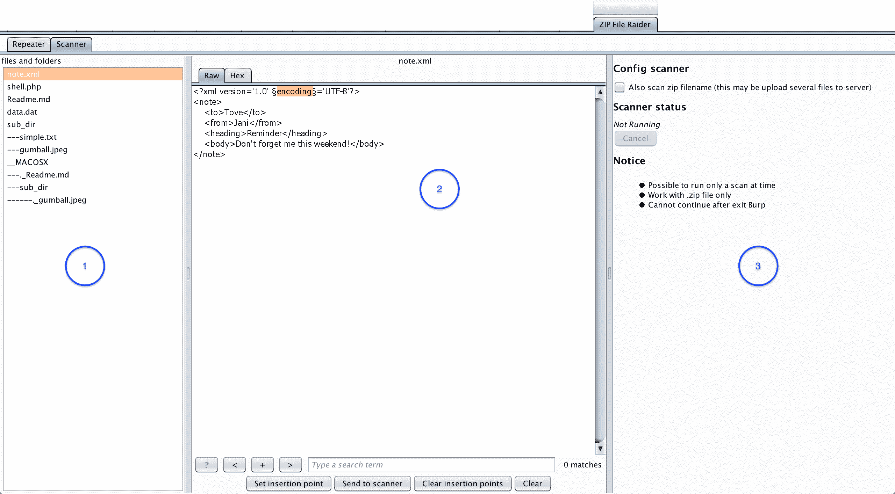

# ZIP 文件袭击者–用于 ZIP 文件有效负载测试的 Burp 扩展

> 原文：<https://kalilinuxtutorials.com/zip-file-raider-burp-extension/>

ZIP 文件袭击者是一个 Burp 套件扩展，用于攻击具有 ZIP 文件上传功能的 web 应用程序。您可以很容易地在 HTTP 请求的 ZIP 内容中注入 Burp 扫描器/中继器有效负载，这在默认情况下是不可行的。这个扩展有助于自动执行提取和压缩步骤。

## **ZIP 文件攻略安装**

1.  在扩展器>选项> Python 环境>中设置 [Jython 独立 Jar](http://search.maven.org/remotecontent?filepath=org/python/jython-standalone/2.7.0/jython-standalone-2.7.0.jar) “选择文件…”。
2.  在 Extender > Extensions > Add >[compressed payloads . py](https://github.com/destine21/ZIPFileRaider/blob/master/CompressedPayloads.py)中添加 ZIP 文件 Raider 扩展(扩展类型:Python)

**也可阅读[deep search——用于暴力的高级网页目录扫描仪](https://kalilinuxtutorials.com/deepsearch-bruteforce/)**

## **如何使用？**

### **将带有压缩文件的 HTTP 请求发送到 ZIP 文件抓取器**

首先，右键单击 HTTP 请求，在 HTTP 主体中有一个压缩文件，然后选择“发送请求到 ZIP 文件突袭机扩展器中继器”或扫描仪。

### **中继器**

这个 Repeater 选项卡可以编辑压缩文件的内容，然后迅速将它转发给服务器。

ZIP 文件攻略的描述–中继器选项卡:

1.  “文件和文件夹”窗格–从上一步骤发送的压缩文件中的文件和文件夹列表(发送请求至…)，选择一个文件以编辑其内容。
2.  编辑窗格–以文本或十六进制模式编辑所选文件的内容(如果要编辑 ZIP 文件中的多个文件，请在编辑一个文件后按“保存”)。
3.  请求/响应窗格–单击“压缩并开始”按钮后，HTTP 请求/响应将显示在此窗格中。

### **扫描仪**

此扫描仪选项卡用于在将 ZIP 文件发送到 Burp 扫描仪之前设置其内容中的插入点。

ZIP 文件攻略–扫描仪选项卡的描述:

1.  “文件和文件夹”窗格–从上一步骤发送的压缩文件中的文件和文件夹列表(发送请求至…)，选择您想要设置插入点的文件。
2.  设置插入点窗格–通过单击“设置插入点”按钮，在选定文件的内容中设置插入点。(插入点将用一对符号括起来)
3.  配置/状态窗格–配置扫描仪并显示扫描仪状态(未运行/正在运行)。

 **信用:Natsasit jirathamanuwat**

***你可以在 [Linkedin](https://www.linkedin.com/company/gbhackers/) 、 [Twitter](https://twitter.com/GbhackerOn) 、[脸书](https://www.facebook.com/gbhackersadmin)上关注我们的日常网络安全更新，你也可以在线参加[最佳网络安全课程](https://ethicalhackersacademy.com/)以保持自我更新。***