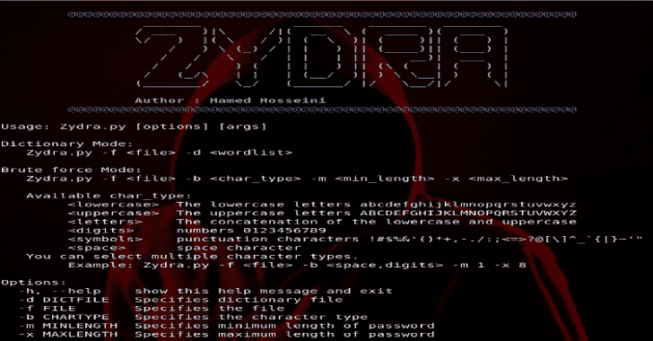
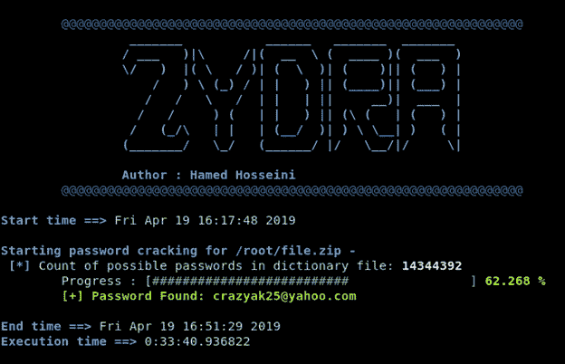
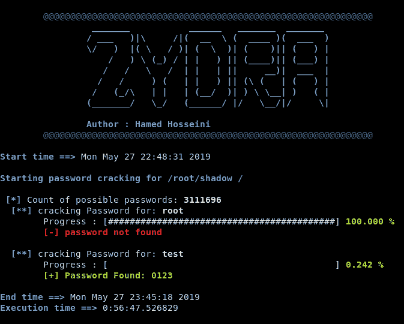

# Zydra:密码恢复工具& Linux 影子文件破解程序

> 原文：<https://kalilinuxtutorials.com/zydra-password-recovery-shadow-file-cracker/>

**Zydra** 是一个文件密码恢复工具和 Linux 影子文件破解工具。它使用字典搜索或暴力破解密码的方法。

**支持的文件**

*   RAR 档案
*   传统 ZIP 文件
*   PDF 文件
*   linux 影子文件(zydra 可以在 Linux 影子文件中逐个找到所有用户的密码)

**先决条件**

要运行该应用程序，最低要求是:

*   Python 3.3 或更高版本
*   基于 debian 的 linux 发行版，最好是 Kali linux 2
*   **qpdf** 和 **unrar** 包
    在 kali 上安装这些包就像在终端上运行以下命令一样简单:
    `**$ sudo apt-get update**``**$ sudo apt-get install qpdf unrar**`
*   这个程序中的一些 python 模块需要手动安装，像:zipfile、rarfile、crypt、pyfiglet、py-term(用于 term 模块)等等。可以使用 pip3 进行安装例如:
    `**$ pip3 install py-term**` **注意** : rar、zip 和 pdf 文件必须有扩展名，影子文件不需要扩展名。

**也读作-[Metabigor:没有任何 API 键的命令行搜索引擎](https://kalilinuxtutorials.com/metabigor-search-engines-api-key/)**

**特色**

*   使用两种方法破解文件密码: **1。**字典法 **2。**蛮力法
*   在强力方法中，您可以指定密码的最小长度和最大长度。
*   在强力方法中，您可以指定密码中可能使用的字符类型。
*   有一个百分比进度条显示该过程已经执行了多少。
*   错误处理。
*   Zydra 最重要的特性之一是加速程序的多重处理特性。例如，如果您有 8 个 CPU 内核，Zydra 将同时使用它们进行处理。

**安装**

通过克隆 Git 存储库下载 Zydra:

**git 克隆 https://github . com/hameda 2/zyra . git**

**用法**

要获得所有选项的列表并了解如何使用该应用程序，请输入以下命令:

**$ python3 Zydra.py -h**

**例题**

*   **字典搜索查找 zip 文件的密码**

在这个例子中，我使用 rockyou.txt 字典

**$ python 3 zydra . py–f file . zip–d rock you . txt**

*   **强力搜索，在影子文件中找到用户的密码**

密码的最小长度是 4，最大长度是 4，我们试图找到由数字和字母组成的密码。

**$ python 3 zydra . py–f shadow–b digits，symbols–m 4–x 4**

**免责声明**

此工具仅用于测试和学术目的，请勿用于非法目的！

[**Download**](https://github.com/hamedA2/Zydra)